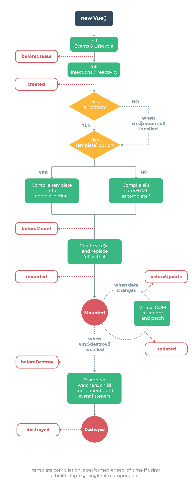

# Vue

- Vue 是一套用于构建用户界面的渐进式框架，Vue 的核心库只关注视图层

## Vue 实例

### 创建 Vue 实例

- 每个 Vue 应用都是通过用 Vue 函数创建一个新的 Vue 实例开始的：

```js
var vm = new Vue({
    // 选项
})
```

### 数据与方法

- 当一个 Vue 实例被创建时，它向 Vue 的响应式系统中加入了其 data 对象中能找到的所有的属性
- 当这些属性的值发生改变时，视图将会产生“响应”，即匹配更新为新的值。

```js
// 我们的数据对象
var data = { a: 1 }

// 该对象被加入到一个 Vue 实例中
var vm = new Vue({
  data: data
})

// 获得这个实例上的属性
// 返回源数据中对应的字段
vm.a == data.a // => true

// 设置属性也会影响到原始数据
vm.a = 2
data.a // => 2

// ……反之亦然
data.a = 3
vm.a // => 3
```

- 只有当实例被创建时 data 中存在的属性才是响应式的
- 除了数据属性，Vue 实例还暴露了一些有用的实例属性与方法。它们都有前缀 $，以便与用户定义的属性区分开来

```js
var data = { a: 1 }
var vm = new Vue({
  el: '#example',
  data: data
})

vm.$data === data // => true
vm.$el === document.getElementById('example') // => true

// $watch 是一个实例方法
vm.$watch('a', function (newValue, oldValue) {
  // 这个回调将在 `vm.a` 改变后调用
})
```

### 生命周期钩子

- 每个 Vue 实例在被创建时都要经过一系列的初始化过程——例如，需要设置数据监听、编译模板、将实例挂载到 DOM 并在数据变化时更新 DOM 等
- 同时在这个过程中也会运行一些叫做生命周期钩子的函数，这给了用户在不同阶段添加自己的代码的机会。

```js
new Vue({
  data: {
    a: 1
  },
  created: function () {
    // `this` 指向 vm 实例
    console.log('a is: ' + this.a)
  }
})
// => "a is: 1"
```



## 计算属性和侦听器

### 计算属性

- 如果 data 中的值需要经过任何复杂逻辑处理，就应当使用计算属性
- 计算属性是基于它们的依赖进行缓存的，只在相关依赖发生改变时它们才会重新求值

#### 计算属性的 setter

- 计算属性默认只有 getter，不过在需要时你也可以提供一个 setter ：

```js
computed: {
  fullName: {
    // getter
    get: function () {
      return this.firstName + ' ' + this.lastName
    },
    // setter
    set: function (newValue) {
      var names = newValue.split(' ')
      this.firstName = names[0]
      this.lastName = names[names.length - 1]
    }
  }
}
```

- 现在再运行 vm.fullName = 'John Doe' 时，setter 会被调用，vm.firstName 和 vm.lastName 也会相应地被更新。

### 侦听器

- 虽然计算属性在大多数情况下更合适，但有时也需要一个自定义的侦听器
- Vue 通过 watch 选项提供了一个更通用的方法，来响应数据的变化，当需要在数据变化时执行异步或开销较大的操作时，这个方式是最有用的

```html
<div id="watch-example">
  <p>
    Ask a yes/no question:
    <input v-model="question">
  </p>
  <p>{{ answer }}</p>
</div>

<script src="https://cdn.jsdelivr.net/npm/axios@0.12.0/dist/axios.min.js"></script>
<script src="https://cdn.jsdelivr.net/npm/lodash@4.13.1/lodash.min.js"></script>
<script>
var watchExampleVM = new Vue({
  el: '#watch-example',
  data: {
    question: '',
    answer: 'I cannot give you an answer until you ask a question!'
  },
  watch: {
    // 如果 `question` 发生改变，这个函数就会运行
    question: function (newQuestion, oldQuestion) {
      this.answer = 'Waiting for you to stop typing...'
      this.debouncedGetAnswer()
    }
  },
  created: function () {
    // `_.debounce` 是一个通过 Lodash 限制操作频率的函数。
    // 在这个例子中，我们希望限制访问 yesno.wtf/api 的频率
    // AJAX 请求直到用户输入完毕才会发出。想要了解更多关于
    // `_.debounce` 函数 (及其近亲 `_.throttle`) 的知识，
    // 请参考：https://lodash.com/docs#debounce
    this.debouncedGetAnswer = _.debounce(this.getAnswer, 500)
  },
  methods: {
    getAnswer: function () {
      if (this.question.indexOf('?') === -1) {
        this.answer = 'Questions usually contain a question mark. ;-)'
        return
      }
      this.answer = 'Thinking...'
      var vm = this
      axios.get('https://yesno.wtf/api')
        .then(function (response) {
          vm.answer = _.capitalize(response.data.answer)
        })
        .catch(function (error) {
          vm.answer = 'Error! Could not reach the API. ' + error
        })
    }
  }
})
</script>
```

- 在这个示例中，使用 watch 选项允许我们执行异步操作 (访问一个 API)，限制我们执行该操作的频率，并在我们得到最终结果前，设置中间状态。这些都是计算属性无法做到的
- 除了 watch 选项之外，您还可以使用命令式的 vm.$watch API

## 条件渲染

- 当 v-if 与 v-for 一起使用时，v-for 具有比 v-if 更高的优先级

## 列表渲染

### 数组渲染

```html
<ul id="example-2">
  <li v-for="(item, index) in items">
    {{ parentMessage }} - {{ index }} - {{ item.message }}
  </li>
</ul>
```

```js
var example2 = new Vue({
  el: '#example-2',
  data: {
    parentMessage: 'Parent',
    items: [
      { message: 'Foo' },
      { message: 'Bar' }
    ]
  }
})
```

- 也可以用 of 替代 in 作为分隔符，因为它是最接近 JavaScript 迭代器的语法

```html
<div v-for="item of items"></div>
```

### 对象渲染

```html
<ul id="v-for-object" class="demo">
  <li v-for="(value, key) in object">
    {{ key }}: {{ value }}
  </li>
</ul>
```

```js
new Vue({
  el: '#v-for-object',
  data: {
    object: {
      firstName: 'John',
      lastName: 'Doe',
      age: 30
    }
  }
})
```

- 还可以引入第三个参数索引

```html
<div v-for="(value, key, index) in object">
  {{ index }}. {{ key }}: {{ value }}
</div>
```

- 在遍历对象时，是按 Object.keys() 的结果遍历，但是不能保证它的结果在不同的 JavaScript 引擎下是一致的

### key

- 当 Vue.js 用 v-for 正在更新已渲染过的元素列表时，它默认用“就地复用”策略
- 如果数据项的顺序被改变，Vue 将不会移动 DOM 元素来匹配数据项的顺序， 而是简单复用此处每个元素，并且确保它在特定索引下显示已被渲染过的每个元素
- 为了给 Vue 一个提示，以便它能跟踪每个节点的身份，从而重用和重新排序现有元素，需要为每项提供一个唯一 key 属性
- 理想的 key 值是每项都有的且唯一的 id
- 它的工作方式类似于一个属性，所以你需要用 v-bind 来绑定动态值

```html
<div v-for="item in items" :key="item.id">
  <!-- 内容 -->
</div>
```

- 建议尽可能在使用 v-for 时提供 key，除非遍历输出的 DOM 内容非常简单，或者是刻意依赖默认行为以获取性能上的提升

### 数组更新检测

#### 变异方法

- Vue 包含一组观察数组的变异方法，所以它们也将会触发视图更新
- push()
- pop()
- shift()
- unshift()
- splice()
- sort()
- reverse()

#### 替换数组

- 变异方法 (mutation method)，顾名思义，会改变被这些方法调用的原始数组
- 相比之下，也有非变异 (non-mutating method) 方法，例如：filter(), concat() 和 slice() 。这些不会改变原始数组，但总是返回一个新数组
- 当使用非变异方法时，可以用新数组替换旧数组：

```js
example1.items = example1.items.filter(function (item) {
  return item.message.match(/Foo/)
})
```

- Vue 并不会丢弃现有 DOM 并重新渲染整个列表
- Vue 为了使得 DOM 元素得到最大范围的重用而实现了一些智能的、启发式的方法，所以用一个含有相同元素的数组去替换原来的数组是非常高效的操作

#### 注意事项

- 由于 JavaScript 的限制，Vue 不能检测以下变动的数组：
1. 当你利用索引直接设置一个项时，例如：vm.items[indexOfItem] = newValue
1. 当你修改数组的长度时，例如：vm.items.length = newLength

```js
var vm = new Vue({
  data: {
    items: ['a', 'b', 'c']
  }
})
vm.items[1] = 'x' // 不是响应性的
vm.items.length = 2 // 不是响应性的
```

- 为了解决第一类问题，以下两种方式都可以实现和 vm.items[indexOfItem] = newValue 相同的效果，同时也将触发状态更新：

```js
// Vue.set
Vue.set(vm.items, indexOfItem, newValue)
// Array.prototype.splice
vm.items.splice(indexOfItem, 1, newValue)
```

- 为了解决第二类问题，你可以使用 splice：

```js
vm.items.splice(newLength)
```

- 由于 JavaScript 的限制，Vue 不能检测对象属性的添加或删除：

```js
var vm = new Vue({
  data: {
    a: 1
  }
})
// `vm.a` 现在是响应式的

vm.b = 2
// `vm.b` 不是响应式的
```

## 事件处理

### 监听事件

- 用 v-on 指令监听 DOM 事件，并在触发时运行一些 JavaScript 代码

```html
<div id="example">
<button v-on:click="greet('you', $event)">Greet</button>
</div>

<script>
var example1 = new Vue({
  el: '#example',
  data: {
  },
  methods: {
    greet: function(message, event){
      if(event) event.preventDefault()
      alert('Hello World!'+message);
    }
  }
})
</script>
```

### 事件修饰符

```html
<!-- 阻止单击事件继续传播 -->
<a v-on:click.stop="doThis"></a>

<!-- 提交事件不再重载页面 -->
<form v-on:submit.prevent="onSubmit"></form>

<!-- 修饰符可以串联 -->
<a v-on:click.stop.prevent="doThat"></a>

<!-- 只有修饰符 -->
<form v-on:submit.prevent></form>

<!-- 添加事件监听器时使用事件捕获模式 -->
<!-- 即元素自身触发的事件先在此处理，然后才交由内部元素进行处理 -->
<div v-on:click.capture="doThis">...</div>

<!-- 只当在 event.target 是当前元素自身时触发处理函数 -->
<!-- 即事件不是从内部元素触发的 -->
<div v-on:click.self="doThat">...</div>
```

- 使用修饰符时，顺序很重要；相应的代码会以同样的顺序产生
- 用 v-on:click.prevent.self 会阻止所有的点击，而 v-on:click.self.prevent 只会阻止对元素自身的点击
- .once 修饰符还能被用到自定义的组件事件上

### 按键修饰符

- Vue 允许为 v-on 在监听键盘事件时添加按键修饰符：

```html
<!-- 只有在 `keyCode` 是 13 时调用 `vm.submit()` -->
<input v-on:keyup.13="submit">
```

- Vue 为最常用的按键提供了别名：

```html
<!-- 同上 -->
<input v-on:keyup.enter="submit">

<!-- 缩写语法 -->
<input @keyup.enter="submit">
```

- 全部的按键别名：
- .enter
- .tab
- .delete (捕获“删除”和“退格”键)
- .esc
- .space
- .up
- .down
- .left
- .right
- 系统修饰键
- .ctrl
- .alt
- .shift
- .meta

### .exact 修饰符

- .exact 修饰符允许你控制由精确的系统修饰符组合触发的事件

```html
<!-- 即使 Alt 或 Shift 被一同按下时也会触发 -->
<button @click.ctrl="onClick">A</button>

<!-- 有且只有 Ctrl 被按下的时候才触发 -->
<button @click.ctrl.exact="onCtrlClick">A</button>

<!-- 没有任何系统修饰符被按下的时候才触发 -->
<button @click.exact="onClick">A</button>
```

### 鼠标按钮修饰符

- .left
- .right
- .middle

## 表单输入绑定

### 基础用法

- 用 v-model 指令在表单 <input>、<textarea> 及 <select> 元素上创建双向数据绑定
- v-model 会忽略所有表单元素的 value、checked、selected 特性的初始值而总是将 Vue 实例的数据作为数据来源
- 应该通过 JavaScript 在组件的 data 选项中声明初始值

```html
<!-- 文本 -->
<input v-model="message" placeholder="edit me">
<p>Message is: {{ message }}</p>

<!--多行文本-->
<span>Multiline message is:</span>
<p style="white-space: pre-line;">{{ message }}</p>
<br>
<textarea v-model="message" placeholder="add multiple lines"></textarea>
```

### 修饰符

#### .lazy

- 在默认情况下，v-model 在每次 input 事件触发后将输入框的值与数据进行同步 (除了上述输入法组合文字时)
- 可以添加 lazy 修饰符，从而转变为使用 change 事件进行同步：

```html
<!-- 在“change”时而非“input”时更新 -->
<input v-model.lazy="msg" >
```

#### .number

- 如果想自动将用户的输入值转为数值类型，可以给 v-model 添加 number 修饰符：

```html
<input v-model.number="age" type="number">
```

- 因为即使在 type="number" 时，HTML 输入元素的值也总会返回字符串

#### .trim

- 如果要自动过滤用户输入的首尾空白字符，可以给 v-model 添加 trim 修饰符：

```html
<input v-model.trim="msg">
```