# 嵌入式

## 嵌入式系统概述

- 嵌入式系统组成：
  - 硬件电路：接口电路、处理器系统电路、系统专用电路
  - 应用软件
  - 实时操作系统
- 嵌入式系统的特点
  - 嵌入性：由于嵌入到对象体系中，必须满足对象系统的环境要求
  - 专用性：嵌入式系统的软、硬件均是面向特定应用对象和任务设计的，具有很强的专用性和多样性
  - 计算机平台：嵌入式系统必须是能满足对象系统控制要求的计算机系统
  - 嵌入式系统的软件固化在非易失性存储器中
  - 嵌入式系统大都有实时性要求，需要在规定的时限内对事件做出正确的反应，如汽车刹车系统

## 计算机体系结构

### 计算机的组成

- 硬件系统：计算机中那些看得见摸得着的物理实体，是计算机的物质基础，包括计算机内部的电子线路和物理装置
  - 存储器：计算机中用于存放程序和数据的部件
  - 运算器：用于信息处理和运算的部件，它对数据进行算术、逻辑运算。运算器通常由算术逻辑部件（ALU）和一系列寄存器组成。
    - ALU是具体完成算术运算与逻辑运算的部件，寄存器用于存放运算的操作数
  - 控制器：整个计算机的控制机构，其功能就是按照事先确定的步骤，控制运算器、存储器和输入设备、输出设备，统一协调地完成所需要的操作
  - 输入设备：把人们编好的程序和原始数据输送到计算机中去，并且把其转换成计算机内部所能识别和接收的信息
  - 输出设备：将计算机的处理结果以人或其他设备所能理解或接收的形式输出，输出信息的形式同样有字符、文字、图形、图像、声音等
- 软件系统：
  - 操作系统
  - 语言处理程序
  - 标准库程序
  - 服务性程序

### 计算机系统性能量化：

- 计算机的性能
  - $$ 计算机的性能=\frac{1}{完成任务所需要的时间} $$
- Amdahl定律：加快某部件执行速度所能获得的系统性能加速比，受限于该部件的执行时间占系统中总执行时间的百分比
- $$系统性能加速比= \frac{系统性能_{改进后}}{系统性能_{改进前}} = \frac{总执行时间_{改进前}}{总执行时间_{改进后}} $$
- 加速比依赖于两个因素：
  - 可改进比例：在改进前的系统中，可改进部分的执行时间在总的执行时间中所占的比例称为可改进比例，它总是小于等于1。
    - 例如：一个需运行60秒的程序中有20秒的运算可以加速，那么这个比例就是20/60
  - 部件加速比：可改进部分改进以后性能提高的倍数称为部件加速比。它是改进前所需的执行时间与改进后执行时间的比，部件加速比总是大于1。
    - 例如：若系统改进后，可改进部分的执行时间是2秒，而改进前其执行时间为5秒，则部件加速比为5/2
- $$加速比= \frac{1}{(1-可改进比)+ \frac{可改进比}{部件加速比} }$$
- Amdahl定律揭示了计算机系统性能改进的两种局限。
  - 第一，部分性能改进的递减局限。即如果仅仅对计算机系统的一部分做性能改进，则改进得越多，所得到的总体性能的提升就越有限。
  - 第二，对计算机系统进行部分性能改进，系统加速比存在极限，极限为$\frac{1}{1-可改进比例}$
- CPU性能公式
  - $$CPU时间=程序CPU时钟周期数×时钟周期=\frac{程序的CPU时钟周期数}{时钟频率}$$
  - $$CPU时间=IC×CPI×CCT$$
  - 影响CPU时间的3个性能参数中，CCT主要取决于芯片加工工艺及CPU硬件结构，CPI主要取决于CPU硬件结构及指令集架构（ISA：Instruction Set Architecture），IC则主要取决于ISA和编译技术
  - 提高性能可以利用的并行性：指令并行、数据并行、线程并行、任务并行
  - 提高并行：时间重叠、资源共享、资源重复
  - 高性能CPU的设计中，促使CPU从单核迈向多核的主要原因有：
    - 功耗问题，即高性能的单核CPU的功耗越来越高
    - 指令集并行性受限
    - 存储器性能提高缓慢
- 冯·诺依曼结构
  - 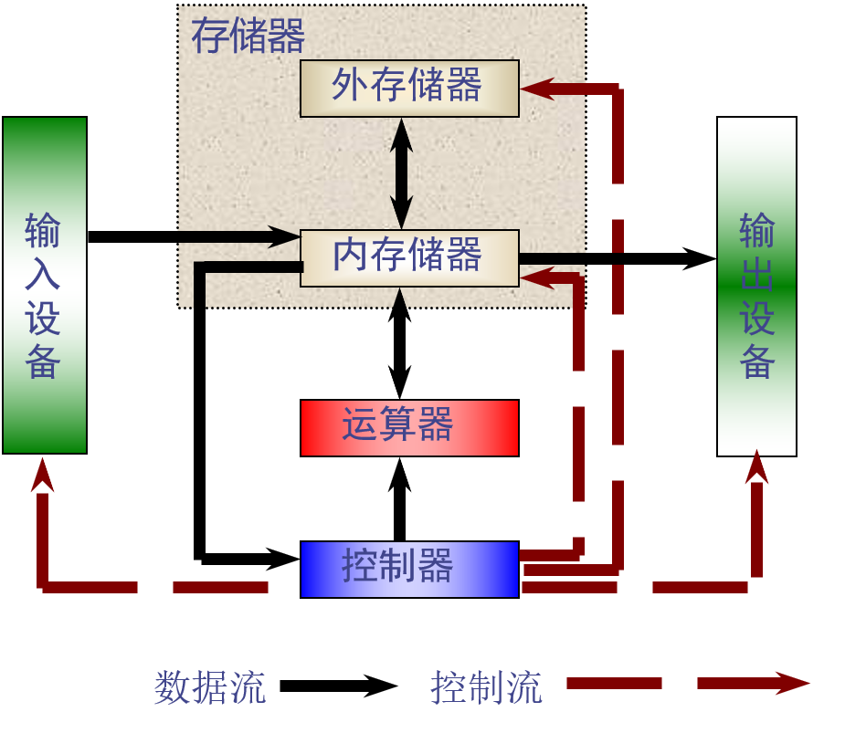
  - 存储程序原理的基本点：指令驱动
    - 程序预先存放在计算机存储器中，计算机一旦启动，就能按照程序指定的逻辑顺序执行这些程序，自动完成由程序所描述的处理工作
  - 冯·诺依曼结构的主要特点
    - 以运算器为中心
    - 在存储器中，指令和数据同等对待
      - 指令和数据一样可以进行运算，即由指令组成的程序是可以修改的
    - 存储器是按地址访问、按顺序线性编址的一维结构，每个单元的位数是固定的
    - 指令的执行是顺序的
      - 一般是按照指令在存储器中存放的顺序执行。
      - 程序的分支由转移指令实现。
      - 由指令计数器PC指明当前正在执行的指令在存储器中的地址。
    - 指令由操作码和地址码组成

## 储存器系统

### 储存器类型

- 按照存储介质分类
  - 半导体储存器：速度快，用作内存
    - 记忆原理：通过触发器（如SRAM）、电容（如DRAM）或浮动栅门（如闪存）对电位的保持作用来存储二进制数据
    - 双极型晶体管
    - 场效应管
  - 磁表面存储器：利用涂覆在载体表面的磁性材料具有两种不同的磁化状态来表示“0”和“1”
    - 存储容量大、单位价格低、记录介质可以重复使用、记录信息可以长期保存而不丢失
    - 可以脱机存档、支持非破坏性读出（读出时不会改变存储元的状态）
  - 光存储器：信息以刻痕的形式保存在盘面上，用激光束照射盘面，靠盘面的不同反射率来读出信息
    - 存储密度高、存储寿命长、价格低
- 按照存取方式分类
  - 随机访问存储器（RAM）
    - 存储单元的内容可按需随意取出或存入，且存取的速度与存储单元的位置无关
    - RAM在断电时将丢失其存储内容
    - RAM可以进一步分为静态随机存储器（SRAM）和动态随机存储器（DRAM）
    - SRAM利用触发器来存储信息，DRAM利用和晶体管集电极相连的电容的充放电来存储信息
    - SRAM数据传输速度快、使用简单、不需刷新、静态功耗极低，其缺点在于SRAM元件数多、集成度低、动态功耗大，SRAM常用作计算机系统中的缓存
    - DRAM集成度远高于SRAM、动态功耗与价格也低于SRAM，但是DRAM因需刷新而需要使用复杂的外围电路，同时也使存取速度也较SRAM慢，它一般用作计算机系统中的主存
  - 只读存储器ROM
    - ROM是存储固定信息的存储器，一般是事先写好的，在工作过程中只能读出，不能改写，常用于存储各种固定程序和数据
    - ROM中所存数据在断电后也不会发生改变，工作可靠，保密性强，一般用于存储程序代码或需要固化的数据
  - 顺序存取存储器
    - 在存取信息时，只能按存储单元的位置，顺序地一个接一个地进行数据的存取
  - 按照存储器信息的可保存性分类
    - 根据断电后是否丢失数据，可将存储器分为易失性存储器和非易失性存储器。易失性存储器在断电后，信息就会丢失，例如SRAM。非易失性存储器或称为永久性存储器在断电后，信息不丢失，例如硬盘
    - 根据读出后是否保持数据，可将存储器分为破坏性存储器和非破坏性存储器。破坏性存储器在数据读出时，原存信息会被破坏，需要重新写入，例如DRAM。非破坏性存储器在数据读出时，原存信息不会被破坏，因而也不需要重新写入，大部分存储器都属于这个类型。
  - 高速缓冲存储器（Cache，简称缓存）是存在于主存与CPU之间的一级存储器，容量相对较小但速度比主存高得多，接近于CPU的速度。缓存一般与CPU集成在同一个芯片中，因此也称之为片上存储，一般用SRAM构建
  - 计算机系统中的主要存储器又称内存，用来存储计算机运行期间较常用的大量的程序和数据。主存一般存在于CPU主板上，常用DRAM构建
- Flash Memory(快闪存储器)
  - Flash Memory是一种可以直接在主机板上修改内容而不需要将IC拔下的内存，当电源关掉后储存在里面的资料并不会流失掉，在写入资料时必须先将原本的资料清除掉，然后才能再写入新的资料，缺点为写入资料的速度太慢
  - 目前嵌入式系统所采用的Flash主要有NOR Flash及NAND Flash
  - NOR的特点是芯片内执行，这样应用程序可以直接在Flash内运行，不必再把代码读到系统RAM中。NOR的传输效率很高，在1～4 MB的小容量时具有很高的成本效益，但是很低的写入和擦除速度大大影响了它的性能
  - NAND结构能提供极高的单元密度，可以达到高存储密度，并且写入和擦除的速度也很快。应用NAND的困难在于Flash的管理和需要特殊的系统接口 
  - 通常用NOR Flash存储启动代码，NAND Flash存储操作系统和应用程序代码。

### 分层存储系统性能

- 分层存储系统设计可行的依据在于程序执行具有时间局部性和空间局部性
- 高速缓冲存储器(Cache)是位于主存与CPU之间的高速小容量存储器，用来存放程序中当前最活跃的程序和数据
- Cache的设计理念：用少量速度较快的SRAM构成Cache置于CPU和主存之间，只将CPU最近需要使用的少量指令或数据，复制到速度较快的Cache中提供给CPU使用
- Cache 的命中
  - 当CPU欲访问某主存字时的两种情况：
  1. 所需内容已在Cache中，称为CPU访问Cache 命中，CPU可直接访问Cache
  2. 所需内容不在Cache中，称为CPU访问Cache不命中（失败）。CPU需访问主存获得所需内容，并将包含所需内容的主存块调入Cache中，以备下次访问
- Cache 命中率：CPU要访问的内容在Cache中的比率
  - 设在一个程序执行期间，访问 Cache 的总命中次数为 $N_c$，访问主存的次数为$N_m$，CPU 访问 Cache 的命中率为H，则有：
  - $$H = \frac{N_c}{N_c+N_m}$$
- Cache的工作过程
  1. 当CPU需要进行访存时，首先给出主存实地址
  2. 地址映像变换机构接收到主存实地址后，根据块号判定所访问的信息字是否在Cache中
    - 若在(Cache命中)，通过地址变换机构将主存块号变换为Cache块地址，再根据块内偏移量，对Cache进行存取
    - 若不在(Cache不命中)，则通知访问Cache块失效。然后通过CPU与主存之间的直接数据通路访问主存，将被访问字直接送给CPU，并将包含该字的新块装入Cache
- Cache的地址映像方式
  - 因为CPU以主存地址访问Cache，所以访存时必须把主存地址变换为Cache的实际地址
  1. 直接映像方式
    - 任何一个主存块只能复制到Cache的某一固定块中
    - 直接映像实际是将主存以Cache的大小划分为若干区，每一区的第0块只能复制到Cache的第0块，每一区的第1块只能复制到Cache的第1块，……
    - 
    - 采用直接映像方式时，主存地址分成三段：
    - 标识（区号） | 区内块号 | 块内偏移量
      - 标识（区号）用于判断Cache命中与否
      - 区内块号直接用于在Cache中进行块寻址
      - 块内偏移量用于块内字或字节的寻址
      - 地址映像机构在判断块命中与否时，只需判断Cache中某一块对应于主存中哪一区即可
    - 地址变换方式
      - 利用标识Cache中的内容实现地址变换
      - 标识Cache用于存放主存块在Cache中的调入情况。标识Cache共有$2^m$个单元，每个单元对应一个Cache块，每个单元中标识信息长n－m位
      - 
      - 直接映像下的标识Cache
        - 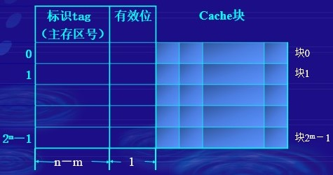
      - 直接映像地址变换
      - 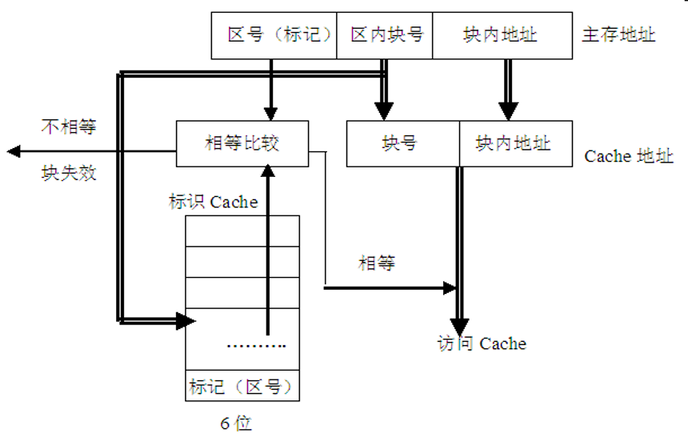
    - 直接映像方式的特点：
      1. 硬件线路简单
      2. 地址变换速度快
      3. 因为主存块在Cache中的位置固定，一个主存块只能对应一个Cache块，所以没有替换策略问题
      4. 块的冲突率高，若程序往返访问两个相互冲突的块，将会使命中率急剧下降
      5. Cache利用率低
  2. 全相联映像及变换
    - 任何主存块可映像到任意一个Cache块
    - 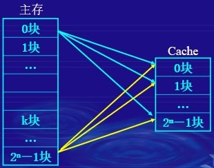
    - 地址变换方式
      - 在全相联映像中，主存块号作为标识，块内偏移量作为索引。主存无分区的概念
      - 主存地址：标识（cache标识） | 块内偏移量
      - 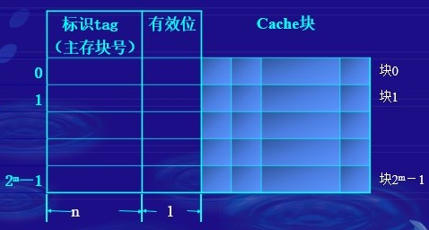
      - 在访存操作时，根据主存地址中的块号在标识Cache中查找是否有相同的主存块号
      - 如果有相同的主存块号，则表示Cache命中，根据对应的Cache块号，对Cache进行访问
      - 如果标识Cache中没有相同的主存块号，则表示Cache不命中，需要对主存进行访问并将主存中的块调入Cache中，同时还要将主存块号写入调入的Cache块对应的标识Cache单元中，以改变地址映像关系
      - 在调入新的主存数据块时，需根据替换策略确定将Cache中的哪一个数据块替换出去
      - 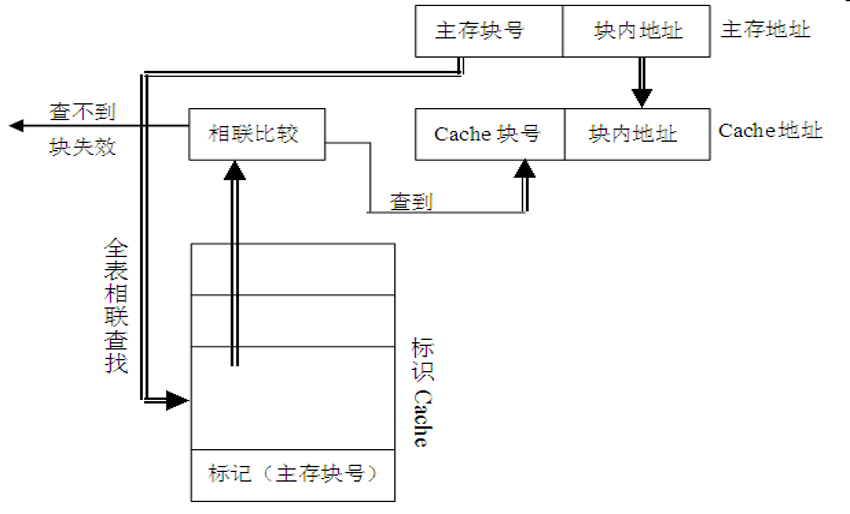
    - 全相联映像方式的特点
      1. 块冲突概率小，Cache命中率高
        - 全相联方法只有在Cache中的块全部装满后才会出现块冲突，所以块冲突概率小 
      2. Cache利用率高
      3. 由于需要相联存储器实现相联访问和实现替换策略的硬件，故硬件复杂，成本高
      4. 相联访问影响访问速度
  3. 组相联映像方式
    - 组相联映像是前两种方式的一种折衷方式
    - 先将Cache块分为若干组，每组中有相同数量的Cache块，再将主存块按与Cache组相同的组数进行分组
    - 规定：主存中的任何一组只能映像到Cache中的某一固定组（类似直接映像），但同一组中的主存块可调入Cache中指定组内的任意块中（类似全相联映像）
    - 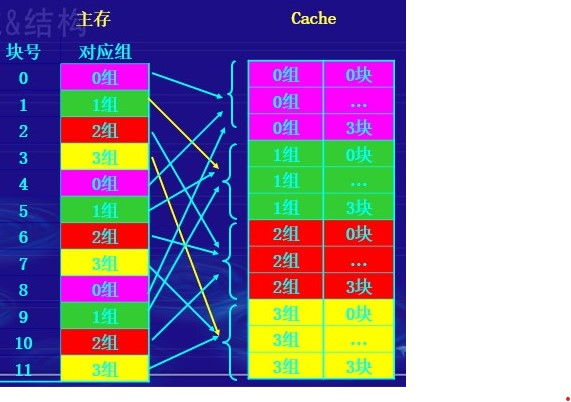
    - 将主存第i 块映像到Cache的第k组，即:
    - k＝i mod G  （G为Cache的组数）
    - 即主存块号除以Cache组数同余的块被映射在一组中
    - 设主存有2n块，Cache有2m块，组数$G＝2^g$，则当用二进制数表示地址时，G 实际上就是主存块地址 i 的低 g 位
    - 
    - 在组相联映像方式下，同一组中的主存块可调入Cache中一个指定组内的任意块中
    - 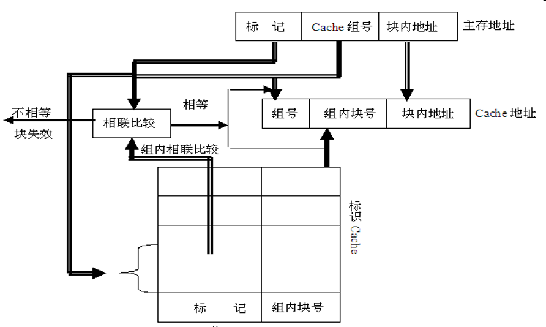
    - 组相联映像下的标识Cache
    - 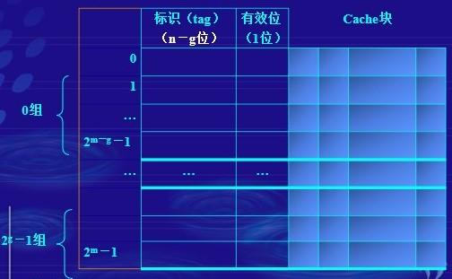
    - 在访存操作时，根据访存地址中的组号，在块表中查找该组对应的若干项中是否有相应的主存标识
    - 如果有且有效位为“1”，表示Cache命中，将在对应的Cache块中根据块内偏移地址对Cache中的相应单元进行访问
    - 如果没有或有效位为“0”，表示不命中，对主存进行访问并将主存中的块按所属的组调入Cache组中合适的块中，同时将主存的组内块号写入标识Cache，以改变地址映像关系
    - 在新的数据块调入时，还需确定将组内的哪一个数据块替换出去

## CPU硬件结构

### 流水线

- 流水线并不能减少(而且一般是增加)单条指令的执行时间，但却能提高吞吐率
- 增加流水线的深度(段数)可以提高流水线的性能，但存在上限
- 流水线的深度受限于流水线的延迟和流水线的额外开销
- 流水线的额外开销包括：
  - 流水寄存器的延迟(建立时间和传输延迟)
  - 时钟扭曲（clock skew）
- 当时钟周期小到与额外开销相同时，流水已没有意义。因为这时在每一个时钟周期中已没有时间来做有用的工作
- 流水线中的相关是指相邻或相近的两条指令因存在某种关联，后一条指令不能在原指定的时钟周期开始执行
- 如果流水线中的指令相互独立，则可以充分发挥流水线的性能。但在实际中，指令间可能会是相互依赖，这会降低流水线的性能
- 相关的种类
  - 结构相关
    - 当硬件资源满足不了同时重叠执行的指令的要求，而发生资源冲突时，就发生了结构相关
  - 数据相关
    - 当一条指令需要用到前面某条指令的结果，从而不能重叠执行时，就发生了数据相关
  - 控制相关
    - 当流水线遇到分支指令和其他能够改变PC值的指令时，就会发生控制相关
- 结构相关解决思路
  - 所有功能单元完全流水化
    - 如将乘法器/除法器流水
  - 设置足够的硬件资源，硬件代价很大。
    - 如采用哈佛结构
  - 有些设计方案允许有结构相关
    - 降低成本
    - 减少部件的延迟
- 数据相关解决思路
  - 利用定向技术减少数据相关引起的暂停
    - 定向技术的主要思路：在发生上述数据相关时，如果能够将计算结果从其产生的地方直接送到需要它的地方，就可以避免暂停
    - 当定向硬件检测到前面某条指令的结果寄存器就是当前指令的源寄存器时，控制逻辑会将前面那条指令的结果直接从其产生的地方定向到当前指令所需的位置
- 控制相关解决思路
  - “冻结”或“排空”流水线
    - 在流水线中停住或删除分支后的指令，直到知道转移目标地址。优点：简单
  - 预测
    - 预测分支指令是否跳转及跳转目标。预测正确，处理器正常执行；预测错误，恢复流水线
  - 延迟分支 (delayed branch)
    - 把分支开销为n 的分支指令看成是延迟长度为n 的分支指令，其后紧跟有n 个延迟槽。流水线遇到分支指令时，按正常方式处理，顺带执行延迟槽中的指令，从而减少分支开销。n个延迟槽指令必须执行

### 总线

- 总线是在模块与模块之间或者设备与设备之间传送信息的一组公用信号线，是系统在主控器(模块或设备)的控制下，将发送器(模块或设备)发出的信息准确地传送给某个接收器(模块或设备)的信号通路
- 总线的特点在于其公用性，即它同时挂接多个模块或设备

### 最小硬件系统

- 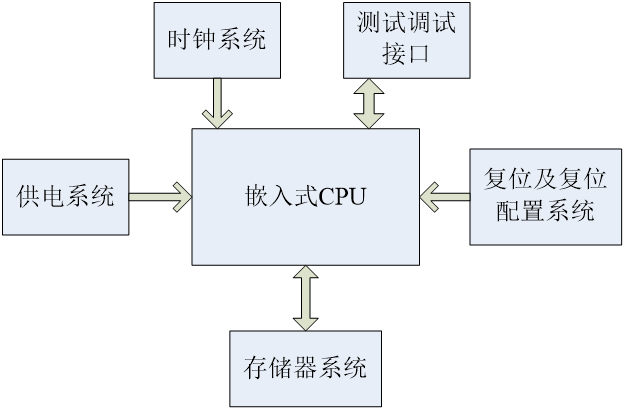

### S3C2410的启动

- S3C2410内部具有NAND Flash控制器，因此可以选择从NOR Flash或从NAND Flash进行启动，可通过OM[1:0]来进行设置。
- 当系统从NOR Flash启动时，要把Flash芯片的首地址映射到0x0000_0000位置；
- 当系统从NAND Flash启动时，S3C2410则会自动将NAND Flash的前面4 KB数据搬移到S3C2410内部的SRAM中，并将内部SRAM的首地址设为0x0000_0000，CPU从地址0x0000_0000处开始运行
- NANA Flash引导
- 
- EEPROM Flash引导
- 

## ARM体系结构

- 两种指令集
  - 16位的Thumb指令集和32位ARM指令集
  - Thumb指令集是ARM指令集的子集。也就意味着每条Thumb指令都有对应的ARM指令，但反之不一定
- 两种工作状态
  - 执行Thumb指令集时工作在Thumb状态下。16bit取指，16bit译码
  - 执行ARM指令集时工作在ARM状态下。32bit取指，32bit译码
- ARM处理器的运行模式
  - ARM处理器共有7种运行模式
  - 用户模式USR（User）：正常程序执行的模式
  - 快速中断模式FIQ（Fiq）：用于高速数据传输或通道处理，用于快速中断服务程序的场合
  - 外部中断模式IRQ（Irq）：用于通用的中断处理场合
  - 管理模式SVE（Supervisor）：供操作系统使用的一种保护模式
  - 数据访问终止模式ABT（Abort）：当数据访问终止时进入该模式，可用于虚拟存储及存储保护
  - 系统模式SYS（System）：用于运行具有特权的操作系统任务
  - 未定义指令终止模式UNDEF（Undefined）：用于处理没有定义的指令，可在该模式中用软件来模拟硬件功能，比如浮点运算

- ARM处理器有37个寄存器
  - 31个通用寄存器：程序计数器、堆栈及其他通用寄存器
  - 6个状态寄存器
  - 这些寄存器不能同时看到，不同的处理器状态和工作模式确定哪些寄存器是对编程者是可见的
  - 
  - 通用寄存器是R0-R15的寄存器，分为三类 
    - 没有对应影子寄存器的寄存器R0-R7 
    - 有对应影子寄存器的寄存器R8-R14
    - 程序计数器R15 (或者PC) 
  - 影子寄存器是指该寄存器在不同的模式下对应的物理寄存器
  - R0-R7
  - 所有模式下，R0-R7所对应的物理寄存器都是相同的
  - 这八个寄存器是真正意义上的通用寄存器
  - 在中断或者异常处理程序中一般都需要对这几个寄存器进行保存
- R8-R14
  - 访问的物理寄存器取决于当前的处理器模式
  - R8-R12各有两组物理寄存器：一组为FIQ模式，另一组是除FIQ以外的其他模式
  - R13-R14各有6个分组的物理寄存器，一个用于用户模式和系统模式，其他5个分别用于5种异常模式
  - R13（也被称为SP指针）被用作栈指针，通常在系统初始化时需要对所有模式下的SP指针赋值，当CPU在不同的模式时栈指针会被自动切换成相应模式下的值
  - R14有两个用途，一是在调用子程序时用于保存调用返回地址，二是在发生异常时用于保存异常返回地址
- CPSR（当前程序状态寄存器）在所有的模式下都是可以读写的，记录当前的处理器状态（程序状态），它主要包含：
  - 条件标志
  - 中断使能标志
  - 当前处理器的模式
  - 其它的一些状态和控制标志

### ARM指令集

- \<op\>{\<cond\>}{S} \<Rd\>,\<Rn\>,\<operand2\>
  - op：操作码，指令功能
  - cond：条件码，执行条件
  - S：状态位，执行结果是否影响状态寄存器
  - Rd：目的寄存器
  - Rn：第1操作数，来源于寄存器Rn
  - operand2：第2操作数
- 条件执行：几乎所有的指令均可包含一个可选的条件码，满足条件码的指令才能执行。如：ADDEQ

### Load/Store指令

- RISC处理器的一大特色就是Load/Store架构，即只有Load/Store指令才能访问存储器
- Load用于把内存中的数据装载到寄存器，Store指令用于把寄存器中的数据存入内存，实现寄存器文件和存储器的数据交换
- 在存储器和寄存器之间传送单一数据指令LDR和STR
- 指令格式： op{cond} type Rd , 地址
  - type表示传送数据的类型，必须是下列值之一：
  - D：表示双字、空：表示字
  - SH：带符号半字、H：无符号半字
  - B：无符号字节、SB：带符号字节

#### 字和无符号字节加载/存储指令

- LDR/STR指令寻址非常灵活，它由两部分组成，其中一部分为一个基址寄存器，可以为任一个通用寄存器；另一部分为一个地址偏移量。地址偏移量有以下3种格式：
- 立即数。立即数可以是一个无符号的数值。这个数据可以加到基址寄存器，也可以从基址寄存器中减去这个数值
  - LDR  R1,[R0,#0x12] ;    R1<-[R0+0x12]
- 寄存器。寄存器中的数值可以加到基址寄存器，也可以从基址寄存器中减去这个数值
  - LDR  R1,[R0,R2]  ;      R1<-[R0+R2]
  - LDR  R1,[R0,-R2] ;      R1<-[R0-R2]
- 寄存器及移位常数。寄存器移位后的值可以加到基址寄存器，也可以从基址寄存器中减去这个数值
  - LDR  R1,[R0,R2,LSL #2] ;R1<-[R0+R2*4]
- 单一加载/存储指令的变址模式有四种：零偏移、前变址、后变址、回写前变址。
- 注意：必须保证字数据操作的地址是32位对齐的
- 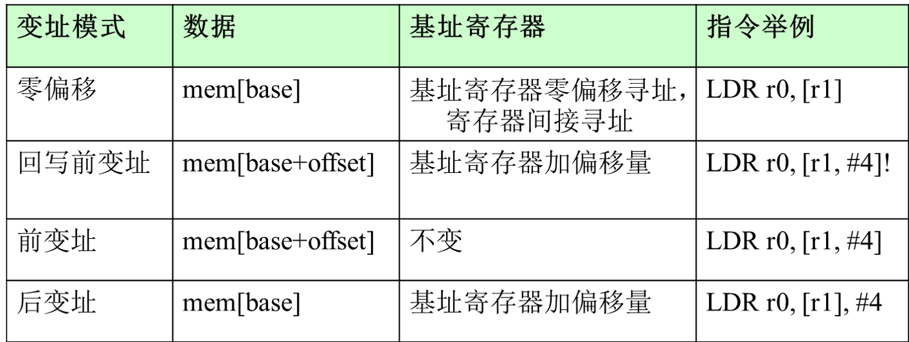

#### 半字和有符号字节加载/存储指令

- LDR{cond}SB Rd,<地址>;将指定地址上的有符号字节读入Rd
- LDR{cond}SH Rd,<地址>;将指定地址上的有符号半字读入Rd
- LDR{cond}H   Rd,<地址>;将指定地址上的半字数据读入Rd
- STR{cond}H   Rd,<地址>;将Rd中的半字数据存入指定地址
- 注意：
  1. 有符号位半字/字节加载是指用符号位加载扩展到32位，无符号半字加载是指用零扩展到32位；
  2. 半字读写的指定地址必须为偶数，否则将产生不可靠的结果
- 应用示例：
  1. 加载/存储字和无符号字节指令
    - LDR	R2,[R5]	;将R5指向地址的字数据存入R2
    - STR	R1,[R0,#0x04]	;将R1的数据存储到R0+0x04地址
    - LDRB	R3,[R2],#-1 	;将R2指向地址的字节数据存入R3，R2＝R2－1
    - STRB	R0,[R3,-R8 ASR ＃2] ;R0->[R3-R8/4],存储R0的最低有效字节
  2. 加载/存储半字和有符号字节指令
    - LDRSB  R1,[R0,R3]	;将R0+R3地址上的字节数据存入R1，高24位用符号扩展
    - LDRH   R6,[R2],#2	;将R2指向地址的半字数据存入R6，高16位用0扩展，读出后，R2=R2+2
    - STRH   R1,[R0,#2]!;将R1的半字数据保存到R0+2地址，只修改低2字节数据，然后R0=R0+2

### 数据处理指令

- ADD、ADC 、SUB 、SBC、RSB、RSC
- 格式：op {cond} {S} Rd, Rn, Operand2
- 说明：
  - ADD(ADC)：Rn+Operand2→Rd (带进位加)
  - SUB(SBC)： Rn-Operand2→Rd (带进位减)
  - RSB(RSC) ：Operand2-Rn→Rd (带进位减)
- 与AND、或ORR、异或EOR和位清零BIC
- 格式：op {cond} {S} Rd, Rn, Operand2
- 说明：
  - BIC：将Rn中的位与 Operand2之中相应位的反码进行与操作，结果送Rd 。
  - 其它命令实现Rn OP Operand2 →Rd
  - 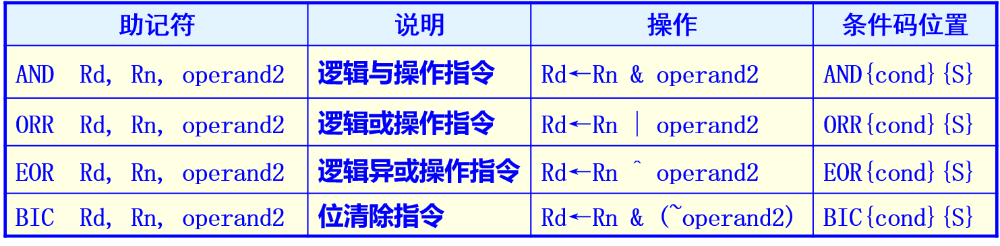
- 传送MOV和传送取反值MVN 指令
- 格式：OP {cond} {S}  Rd, Operand2
- 说明：
  - MVN将Operand2按位取反送Rd
  - Operand2只能是寄存器或立即数
- 分支指令
- 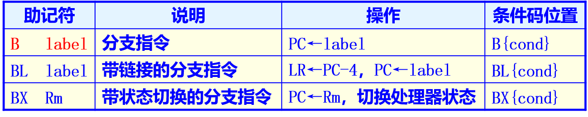
- 直接转移指令B
- 该指令跳转范围限制在当前指令的±32M字节地址内(ARM指令为字对齐，最低2位地址固定为0)。指令格式如下：
- B WAITA			; 跳转到WAITA标号处 
- B 0x1234		; 跳转到绝对地址0x1234处
- 带链接转移BL指令
- Label为程序相对偏移表达式；BL指令先将下一条指令的地址拷贝到R14，然后转移到label

## 寻址方式

- 根据指令中给出的地址信息取得操作数物理地址的方式。
- 对于ARM指令来说，一般特指找到operand2的方式
- Operand2形式：
  - #immed_8r、 Rm、 Rm, shift（寄存器+移位）
- 寄存器寻址
  - 操作数的值在寄存器中，指令中的地址码字段指出的是寄存器编号，指令执行时直接取出寄存器值来操作
  - MOV  R1,R2	    ;将R2的值存入R1 
  - SUB  R0,R1,R2    ;将R1的值减去R2的值，结果保存到R0 
- 立即寻址
  - 立即寻址指令中的操作码字段后面的地址码部分即是操作数本身，也就是说，数据就包含在指令当中，取出指令也就取出了可以立即使用的操作数(这样的数称为立即数)
  - SUBS	R0,R0,#1     ;R0减1，结果放入R0，并且影响标志位
  - MOV	  R0,#0xFF000  ;将立即数0xFF000装入R0寄存器
  - 立即数
    - 格式： #<32位立即数>
    - #<32位立即数>是取值为数字常量的表达式，并不是所有的32位立即数都是有效的，有效的立即数很少。它必须由一个8位的立即数循环右移偶数位得到
    - ADD r3, r7, #1020  ; 1020是0xFF循环右移30位后生成的32位立即数
  - 数据处理指令中留给Operand2操作数的编码空间只有12位，需要利用这12位产生32位的立即数。其方法是：
  - 把指令最低8位（bit[7:0]）立即数循环右移偶数次
    - 例如：MOV R4, #0x8000000A ;其中的立即数 #0x8000000A 是由8位的 0xA8 循环右移 0x4 位得到
- 寄存器移位寻址
  - 寄存器移位寻址是ARM指令集特有的寻址方式。当第2个操作数是寄存器移位方式时，第2个寄存器操作数在与第1个操作数结合之前，选择进行移位操作
  - MOV	R0,R2,LSL #3 ; R2的值左移3位，结果放入R0，即是 R0=R2×8
  - ANDS	R1,R1,R2,LSL R3 ; R2的值左移R3位，然后和R1相“与”操作，结果放入R1
- 寄存器间接寻址
  - 寄存器间接寻址指令中的地址码给出的是一个通用寄存器的编号，所需的操作数保存在寄存器指定地址的存储单元中，即寄存器为操作数的地址指针
  - LDR	R1,[R2]	; 将R2指向的存储单元的数据，读出保存在R1中
  - SWP	R1,R1,[R2]	;将寄存器 R1 的值和 R2 指定的存储单元的内容交换
- 移位操作
  - LSL移位操作：左移，在右边补 0
  - LSR移位操作：右移，在左边补 0
  - ASR移位操作： 算数右移
  - ROR移位操作：
  - RRX移位操作：
- 基址寻址
  - 基址寻址就是将基址寄存器的内容与指令中给出的偏移量（<4K）相加/减，形成操作数的有效地址
  - LDR	R2,[R3,#0x0C] ; 读取R3+0x0C地址上的，存储单元的内容，放入R2
  - STR	R1,[R0,#-4]! ; 先R0=R0-4，然后把R1的值，寄存到保存到R0指定的存储单元
  - LDR	R0,[R1],#4; R0=[R1],R1=R1+4
  - LDR R0,[R1,#4]; R0=[R1+4]
  - LDR R0,[R1,#4]! R0=[R1+4],R1=R1+4
  - LDR R0,[R1,R2]; R0=[R1+R2]
- 多寄存器寻址
  - 多寄存器寻址一次可传送几个寄存器值，允许一条指令传送16个寄存器的任何子集或所有寄存器
  - LDMIA	R1!,{R2-R7,R12}  ;将R1指向的单元中的数据读出到R2～R7、R12中(R1自动加4) 
  - STMIA	R0!,{R2-R7,R12}  ;将寄存器R2～R7、R12的值保存到R0指向的存储; 单元中(R0自动加4)
- 堆栈寻址
  - 堆栈是一个按特定顺序进行存取的存储区，操作顺序为“后进先出”
  - 堆栈寻址是隐含的，它使用一个专门的寄存器(堆栈指针)指向一块存储区域(堆栈)，指针所指向的存储单元即是堆栈的栈顶
  - 存储器堆栈可分为两种：
    - 向上生长：向高地址方向生长，称为递增堆栈
    - 向下生长：向低地址方向生长，称为递减堆栈
  - 堆栈指针指向最后压入的堆栈的有效数据项，称为满堆栈；堆栈指针指向下一个待压入数据的空位置，称为空堆栈
- 相对寻址
  - 相对寻址是基址寻址的一种变通。由程序计数器PC提供基准地址，指令中的地址码字段作为偏移量，两者相加后得到的地址即为操作数的有效地址
  - BL	 SUBR1	;调用到SUBR1子程序
	- BEQ	LOOP	;条件跳转到LOOP标号处
	- ....
	- LOOP  MOV	R6,#1
	- ....
	- SUBR1	... 

## Linux

### 目录操作命令

- ls
  - 列出一个或多个文件的信息，缺省为当前目录下
  - 命令格式 ：ls [选项] [文件目录列表]
  - 选项
    - -a：显示目录下的所有文件及目录 
    - -A ：同 -a ，但不列出 "." (目前目录) 及 ".." (父目录)
    - -S：按文件大小排序列表
    - -l：使用长列表格式列出详细信息
    - -t：按文件的最后修改时间排序列表
  - more ：一页一页的显示，方便使用者逐页阅读，而最基本的指令就是按空白键（space）就往下一页显示，按 b 键就会往回（back）一页显示
  - ls -lih
  - 2408949  -rwxr-xr-x 1 root root 7 04-21 12:47 lsfile.sh
    - 第一字段：inode(索引节点)
    - 第二字段：文件种类(-)和权限(rwx，共9位，分别控制文件属主、用户组以及其它用户的权限 )
    - 第三字段：硬链接个数；lsfile.sh这个文件没有硬链接；因为数值是1，就是他本身
    - 第四字段：属主
    - 第五字段：所归属的组
    - 第六字段：文件或目录的大小(字节)
    - 第七字段和第八字段：最后访问或修改时间
    - 第九字段：文件名或目录名 
- pwd(print working directory)：打印当前工作目录的全路径名（绝对路径）
- cd(change directory)
  - cd:改变当前目录为dir
  - 格式 ：cd [-PL] [dir]
- mkdir(make directories)
  - mkdir:创建一个或多个目录。其中子目录名为最多255个任意字符（除“/”）的字符串
  - 格式： mkdir [选项] [目录]
  - 选项
    - -m:设置许可模式
    - -v:为每一个创建的目录显示一条消息
- rmdir (remove directory)
  - 删除一个或多个空目录。任何一个目录都必须是空目录，否则命令会指出这不是一个空目录。目录名支持通配符
  - 格式：rmdir [选项] [目录]
  - 选项
    - -ignore-fail-on-non-empty: 忽略非空目录的错误信息，继续删除下一个而不报错
    - -p：删除指定目录后，若该目录的上层目录已变成空目录，则将其一并删除
- cp(copy)
  - cp:复制一个或多个文件或目录
  - 格式：
    - cp　[选项]　 源文件    目标文件
    - cp　[选项]　 源文件组 　目标目录
  - 源文件：要拷贝的文件。
  - 目标文件：目标名。也可以是目录名，这种情况下，源文件名作为目标文件名，而文件放在该目录下
  - 选项：
    - -a		在备份中保持尽可能多的源文件结构和属性
    - -b		作将要覆盖或删除文件的备份
    - -f		删除已存在的目标文件
    - -i		提示是否覆盖已存在的目标文件
    - -p		保持原先文件的所有者，组权限和时间标志
    - -r /-R 	递归拷贝目录
- rm(remove)
  - 从文件系统中删除文件及整个目录
  - 格式：rm  [选项]  文件列表
  - 选项：
    - -f:指定强行删除模式。忽略已经设置的-i
    - -i:指定交互模式。删除文件前提示用户是否要删除，忽略已经设置的-f
    - -r: 以递归方式删除目录中的内容（删除文件列表中指定的目录，若不用此标志则不删除目录）。
    - -v:删除每个文件前回显文件名
- mv
  - 格式：
    - mv [-f] [-i] 文件1    文件2
    - mv [-f] [-i] 目录1    目录2
    - mv [-f] [-i] 文件列表 目录
  - -f：强制模式。通常情况下，目标文件存在但用户没有写权限时，mv会给出提示。本选项会使mv命令执行移动而不给出提示
  - -i：交互模式。当移动的目录已存在同名的目标文件名时，用覆盖方式写文件，但在写入之前给出提示
- chmod (change mode)权限设置
  - 改变文件包括目录文件的访问许可。但符号链接文件除外。因为符号链接文件本身的访问许可从不可用
  - 但如果在命令中出现了一个符号链接文件，那么改变的是该链接文件所指向的文件的访问许可
  - 在以递归方式遍历目录时，此命令将忽略符号链接
  - 格式：chmod　[选项]　文件和目录列表
  - 用户分类：user     group    other 
  - 权限：r 可读，w 可写，x 可执行
  - 权限设置，字符串形式或八机制数设置
    - 字符串形式：用户类型  +/-许可的种类
      - 用户类型：u 表示“用户（user）”，即文件或目录的所有者。g 表示“同组（group）用户”，即与文件属主有相同组ID的所有用户。o 表示“其他（others）用户”。 a 表示“所有（all）用户”。它是系统默认值
    - 八进制数形式：x、w和r所对应的数值分别是1，2和4。如若要rw-属性则4+2=6

### Shell编程

- shell环境变量
  - HOME：用户主目录的全路径名
    - 主目录是开始工作的位置，默认情况下，普通用户的主目录为/home/用户名，root用户的主目录为/root
  - LOGNAME：用户名（注册名）
  - PATH：Shell从中查找命令的目录列表，PATH变量包含有带冒号分界符的字符串，这些字符串指向含有你所使用命令的目录
    - PATH变量中的字符串顺序决定了先从哪个目录查找
  - PWD：你当前的工作目录的路径，它指出目前你在什么位置
- Shell系统变量
  - $#  表示命令行上参数的个数。
  - $?  表示上一条命令执行后的返回值。
  - $$  当前进程的进程号。
  - $*/ $@ 表示命令行Shell程序的所有参数串。
  - $0  命令行上输入的Shell程序名。
- 变量名
  - 用户定义的变量是最普通的shell变量。变量名是以字母或下划线打头的字母、数字和下线线序列，并且区分大小，变量名的长度不受限制
- 变量赋值
  - 变量名=字符串
  - 例如，myfile=/usr/meng/ff/m1.c中的“myfile”是变量名，“=”是赋值号，字符串/usr/meng/ff/m1.c是赋予变量myfile的值
  - 注意：在赋值语句中，赋值号“=”的两边没有空格，否则在执行时会引起错误
- 引用变量值
  - 在程序中使用变量的值时，要在变量名前面加上一个符号“$”。这个符号告诉shell，要取出其后变量的值
  - 例如，用echo命令显示变量值：
  ```shell
  $ dir=/usr/meng/ff
  $ echo  $dir
  /usr/meng/ff（显示结果）
  $ echo  dir
  dir
  ```
- 命令替换
  - 可以将一个命令的执行结果赋值给变量
  - $ dir=$（pwd）
- 算术运算
  - let 算术表达式
  - 例：let a=$a+1

## 嵌入式Linux程序设计

- 嵌入式Linux开发步骤
  1. 建立交叉编译环境
  2. 编写和编译应用程序
  3. 连接主机系统和目标系统
  4. 下载目标代码到目标板执行调试
- 编译器GCC
  - GCC的处理过程
  - 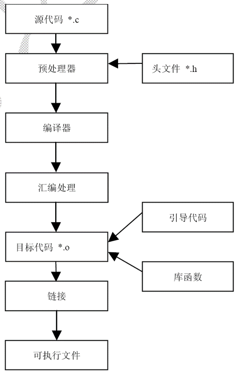
  - GCC编译器的编译过程可以分为四个阶段，即预处理(Pre-Processing)、编译(Compiling)、汇编(Assembling)和链接(Linking)
- 交叉编译与Make工具
  - 交叉编译：在PC上编译出适用于嵌入式设备CPU架构的软件
  - 当修改了其中某个源文件时，如果其他源文件依赖于该文件，则也要重新编译所有依赖该文件的源文件
  - 当test.c或test.h文件在编译之后又被修改，则make工具可自动重新编译test.o。如果在前后两次编译之间，test.c和test.h均没有被修改，而且test.o还存在，就没有必要重新编译test.o