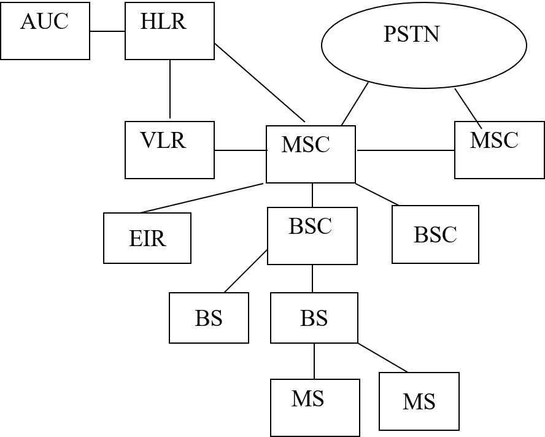
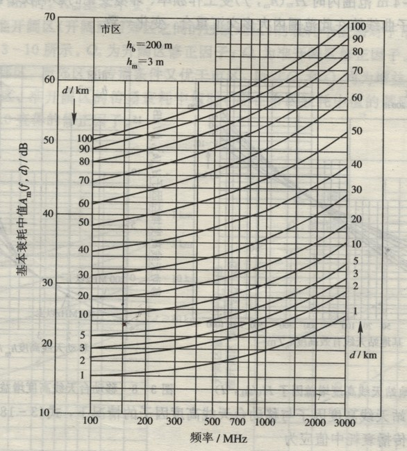
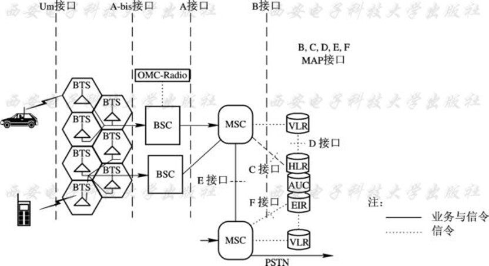
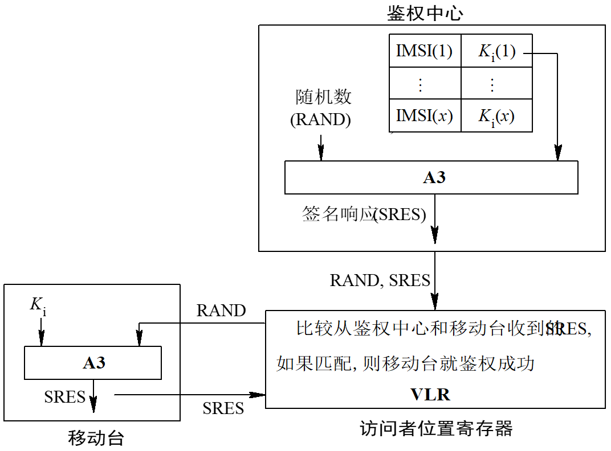
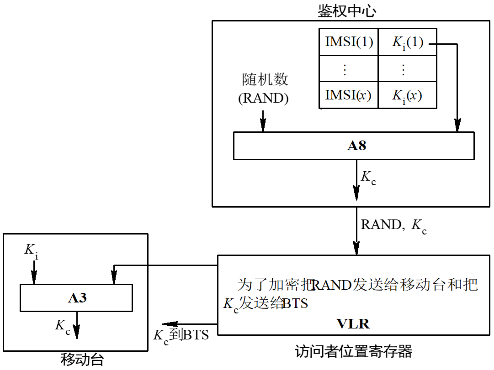
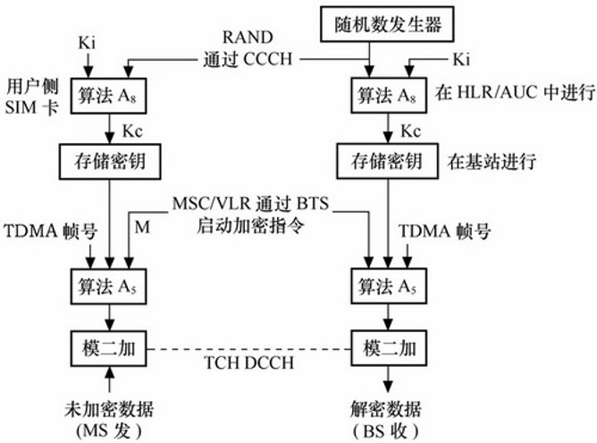
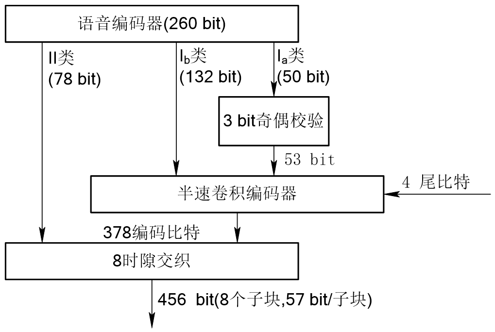
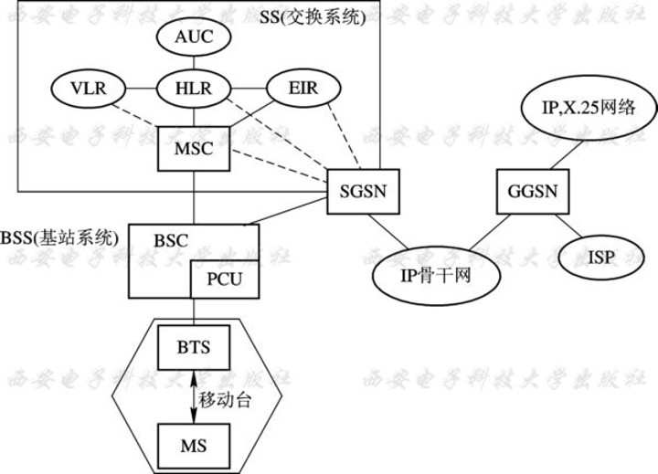

# 移动通信

## 概述

- 移动通信及其特点
  - 多普勒频移效应
    - 频移值$f_d$与移动台运动速度v、工作频率f（或波长$\lambda$）及电波到达角$\theta$有关
    - $$ f_d=\frac{v}{\lambda}cos\theta $$
    - 多普勒频移效应导致附加调频噪声
- 移动通信的工作方式
  - 按照用户的通话状态和频率使用的方法，可分为三种工作方式：
    - 单工制：通信时只能收或发，收发交替进行以相互通信
    - 双工制：通信双方可同时进行收和发。
      - 双工制分为频分双工（FDD，也成异频双工）和时分双工（TDD，也称同频双工）
    - 半双工：通信端采用双工制，移动台采用单工制。收发使用不同的频率，同一部电台的收发信机可以交替工作
- 蜂窝移动通信系统的基本结构
- 
- 移动通信系统的频段使用
  - 移动通信使用VHF（甚高频）和UHF（特高频）频段，主要原因为：
    - VHF/UHF频段较适合移动通信，其传播范围在视距范围内
    - 天线较短，便于携带和移动
    - 抗干扰能力强
- 多址方式
  - 解决多用户使用同一频谱资源问题
  - 频分多址(FDMA)
    - 不同信号被分配到不同频率的信道里
  - 时分多址(TDMA)
    - 一个信道由一连串周期性的时隙构成。不同信号的能量被分配到不同的时隙里
  - 码分多址(CDMA)
    - 每一个信号被分配一个伪随机二进制序列进行扩频，不同信号的能量被分配到不同的伪随机序列里
  - 空分多址(SDMA)
    - 核心技术——智能天线的应用
    - 根据空间位置区分不同用户的信号
    - 通常配合其他多址技术应用
- 其他常用技术用以改进无线链路性能的技术：
  - 均衡技术
    - 补偿时分信道中由于多径效应而产生的符号间干扰（ISI）
  - 分集技术
    - 分集的概念：如果一条无线传播路径中的信号经历了深度衰落，那么另一条相对独立的路径中可能包含着较强的信号。接收机在多径信号中选择多个信号进行合并，以提高信噪比
    - 另一种补偿信道衰落的技术，常用的有：空间分集、频率分集、时间分集、极化分集
  - 信道编码技术
    - 在传输数据中引入冗余度来纠错和检错,提高传输的可靠性
    - 纠错码和检错码有三种基本类型:分组码、卷积码和Turbo码
- 5G
  - 关键技术
    - 大规模天线阵列、超密集组网、新型网络架构、新型多址技术、全频谱接入技术

## 移动通信网

### 移动通信体制

- 大区制
  - 一个服务区域(如一个城市)内只有一个或几个基站BS，并由它负责移动通信的联络和控制
  - 优点 ：简单、投资少、见效快
  - 缺点：为了避免相互间的干扰，在服务区内的所有频道(一个频道包含收、发一对频率)的频率都不能重复
- 小区制
  - 把整个服务区域划分为若干个无线小区，每个小区分别设置一个基站，负责本区移动通信的联络和控制
  - 同时，又可在移动业务交换中心的统一控制下实现小区之间移动用户通信的转接，以及移动用户与市话用户的联系
  - 增大蜂窝系统容量的方法：
    - 小区分裂：将拥塞的小区分成更小的小区
    - 小区扇形化：依靠基站方向性天线来减少同频干扰以提高系统容量
    - 覆盖区域逼近
  - 特点：频率的利用率高；组网灵活；能够有效地解决频道数量有限和用户数增大的矛盾
  - 无线小区的范围不宜过小

### 移动通信网的频率配置

- 蜂窝移动通信系统的收发频差表
- 

### 移动通信环境下的干扰

#### 同频道干扰

- 所有落在收信机通带内的与有用信号频率相同或相近的干扰信号（非有用信号）称为同频道干扰

#### 邻频道干扰

- 工作在k频道的接收机受到工作于k±1频道的信号的干扰，即邻道（k±1频道）信号功率落入k频道的接收机通带内造成的干扰 

#### 互调干扰

- 产生互调干扰的基本条件：
  - 几个干扰信号（ωA、ωB、ωC）与受干扰信号的频率（ωS）之间满足2ωA­ωB =ωS或ωA+ωB ­ωC =ωS条件
  - 干扰信号的幅度足够大
  - 干扰（信号）站和受干扰的接收机都同时工作
- 发射机互调干扰
  - 一部发射机发射的信号进入了另一部发射机，并在其末级功放的非线性作用下与输出信号相互调制，产生不需要的组合干扰频率，对接收信号频率与这些组合频率相同的接收机造成的干扰
- 接收机互调干扰
  - 当多个强干扰信号进入接收机前端电路时，在其非线性作用下，干扰信号互相混频后产生可落入接收机中频频带内的互调产物而造成的干扰

#### 阻塞干扰

- 当外界存在一个离接收机工作频率较远但能进入接收机作用于其前端电路的强干扰信号时，由于接收机前端电路的非线性而造成对有用信号增益降低或噪声增高，使接收机灵敏度下降的现象
- 干扰与干扰信号的幅度有关，幅度越大，干扰越严重

#### 近端对远端的干扰

- 当基站同时接收从两个距离不同的移动台发来的信号时，距基站近的移动台B（距离d2）到达基站的功率明显要大于距离基站远的移动台A（距离d1，d2＜＜d1）的到达功率，若二者频率相近，则距基站近的移动台B就会造成对接收距离站远的移动台A的有用信号的干扰或仰制，甚至将移动台A的有用信号淹没

#### 信道分配策略

- 信道分配策略可分为两类：固定的信道分配策略和动态的信道分配策略
- 固定信道分配法 ：将某一组信道固定分配给某一基站，即基站的频点是固定不变的
  - 特点：控制方便，投资少 ，但信道的利用率下降
- 动态信道分配法：不是将信道固定地分配给某个基站，而是多个基站均可使用同一信道 ，进一步提高频谱的利用率，使信道的配置方法能够随移动通信系统的地理分布变化而变化
  - 特点：频谱的利用率大约可提高百分之二十 ；需智能控制  ，避免了忙闲不均的情况；但此时的邻近的信道干扰比较突出，预测和控制系统均比较复杂

### 多信道共用技术

- 独立信道方式 :一个无线区有N个信道，把用户分别指定一个信道，不同信道内的用户不能互换信道
- 多信道共用方式 :在一个无线小区内的N个信道，为该区内所有用户共用，则当k（k< N）个信道被占用时，其他需要通话的用户可以选择剩下的任一空闲信道通话

#### 话务量与呼损

- 呼叫话务量：指单位时间内（1小时）进行的平均电话交换量
- $$ A=Ct_0 $$
  - C：每小时平均呼叫次数（包括呼叫成功和呼叫失败的次数）
  - $t_0$：每次呼叫平均占用信道的时间（包括接续时间和通话时间）
  - 如果$t_0$以小时为单位，则话务量A的单位是爱尔兰(Erlang，占线小时)
- 呼损率
  - 当多个用户共用时，会出现许多用户虽然发出呼叫，但因无信道而不能通话 （即呼叫失败 ）。在一个通信系统中，造成呼叫失败的概率称为呼叫失败概率，简称为呼损率（B）
  - $$ B=\frac{A-A'}{A}=\frac{C-C_0}{C} $$
    - A'：呼叫成功而接通电话的话务量，简称为完成话务量。
    - A-A'：损失话务量 。
    - C：总呼叫的次数
    - $C_0$：一小时内呼叫成功而通话的次数
  - 物理意义：损失话务量与呼叫话务量之比的百分数
  - 呼损率B愈小，成功呼叫的概率越大，用户就越满意。因此，呼损率也称为系统的服务等级（或业务等级）
- 呼损率和话务量是一对矛盾，即服务等级和信道利用率是矛盾的
- 如果呼叫有以下性质：
  - 每次呼叫相互独立，互不相关（呼叫具有随机性）
  - 每次呼叫在时间上都有相同的概率；并假定移动电话通信服务系统的信道数为n
- 则呼损率可计算如下：
- $$ B=\frac{\frac{A^n}{n!}}{\sum_{i=1}^n\frac{A^i}{i!}} $$
- 上式为电话工程中的Erlang公式
- 繁忙小时集中度(K) 
  - $$ K=\frac{忙时话务量}{全日话务量} $$
  - K 一般为 8%~14% 
- 每个用户忙时话务量（$A_a$）
  - $$ A_a=\frac{CTK}{3600} $$
    - C：每一用户每天平均呼叫次数
    - T：每次呼叫平均占用信道的时间（单位为秒）
    - K：忙时集中度
  - 物理意义：$A_a$为最忙时间的那个小时的话务量，是统计平均值
- 每个信道能容纳的用户数（m）
  - 当每个用户忙时的话务量确定后，每个信道所能容纳的用户数m可由下式决定 ：
  - $$ m=\frac{\frac{A}{n}}{\frac{CTK}{3600}}=\frac{\frac{A}{n}}{A_a}=\frac{\frac{A}{A_a}}{n} $$
  - 每个信道的m，是与在一定呼损条件下的信道平均话务量成正比，而与每个用户忙时话务量成反比

### 移动性管理

#### 位置管理

- 确保移动台能被有效地寻呼到
- 位置更新
  - BTS周期性地向MS广播相应的LA地址。
  - 当MS收到的LA位置信息与所存储的位置信息不同时，MS就向网络发送一个注册消息
- 寻呼
  - 当呼叫某移动用户时，移动通信网络需要及时通过有效的寻呼策略将该呼叫传递到该移动用户
  - 寻呼策略的要求：
    1. 寻呼方案对移动网络所消耗的信令代价需要比较小
    2. 寻呼时延需要比较小
    3. 实用性需要较强
  - 静态寻呼策略（同步全呼）
    - 当有呼叫到来时，移动网络在移动终端所在位置区内的所有小区同时发起对目标移动终端的寻呼（寻呼区=位置区）
    - 优点：寻呼延迟最小
    - 缺点：依赖于位置区内蜂窝数目的大小，容易引起过量的信令负载

#### 切换管理

- 确保移动台跨小区或跨MSC时原有业务的连续性
- 当一个移动台（MS）正通过无线链路连接到某个BS进行通话时，如果该MS渐渐离开该BS移动到另一个BS覆盖的区域，则连接到原BS的无线链路最终被迫中断，因此，需要及时建立一条到新BS的链路，以保持继续通话，这一过程称之为切换
- 硬切换
  - 通前断（break before make）
  - 移动台需先中断与原基站的联系，再与新基站取得联系
- 软切换
  - 断前通（make before break）
  - 先与新基站（可能不止1个）取得联系，在保证业务切换成功后，才中断与原基站的通信
  - 目前应用于具有相同载波的CDMA信道之间
- 更软切换
  - 发生在同一基站具有相同频率的不同扇区之间的切换
  - 更软切换只由基站完成，一般不通知MSC
- 切换检测策略
  - 移动台控制的切换（MCHO）
    - 通过移动台持续监视通信端口的信号强度和质量，当满足切换条件时，移动台选择一个最好的切换侯选项并发起切换请求
  - 网络控制的切换（NCHO）
    - BS监督来自MS的信号强度与质量。当这些参数低于某些阈值时，网络安排一次到另一个BS的切换
    - 网络要求附近所有的BS监督来自某个MS的信号，并将测量结果报告给网络。然后，网络为切换选择一个新BS，并同时通知该MS（通过原BS）和新BS
  - 移动台辅助的切换（MAHO）
    - 网络是控制切换的主体，网络要求MS测量来自周围BS的信号，并向原BS报告测量结果，因而网络能够确定是否需要切换，以及切换到哪一个BS
- 无线资源管理技术
  - 无线资源管理的研究内容主要包括：
    - 功率控制
    - 接入控制
    - 负载（拥塞）控制
    - 信道分配
    - 分组调度
- 信道自动选择方式
  - 专用呼叫信道方式
    - 在给定的多个共用信道中，**选择一个专用呼叫信道专门用作呼叫处理与控制**，而其余信道作为业务（话音或数据）信道
  - 循环定位方式
  - 循环不定位方式
  - 循环分散定位方式

## 移动通信的电波传播

- 当前陆地移动通信主要使用的频段VHF和UHF, 即150MHZ、450MHZ、900MHZ、1800MHZ
- 移动通信中电波传播的方式主要有直射波、反射波和地表面波等传播方式
- 自由空间的电波传播损耗: 
- $$ L_{bs}=32.45+20\lg d(km)+20\lg f(MHz) dB$$
  - d为距离(km)，f为工作频率(MHz)

### 多径衰落

- 包络满足瑞丽分布，相位满足均匀分布
- 如果存在一个起支配作用的直达波（未受衰落影响），此时，接收端接收信号的包络为莱斯（ Rician ）分布

### 奥村(Okumura)模型

- 思路：将城市视为“准平滑地形”，给出城市场强中值。对于郊区，开阔区的场强中值，则以城市场强中值为基础进行修正。对于“不规划地形”也给出了相应的修正因子。由于这种模型给出的修正因子较多，可以在掌握详细地形，地物的情况下，得到更加准确的预测结果
- OM模型适用的范围：频率150 ~ 1920MHZ，可扩展到3000MHZ,基地站天线高度为20 ~ 1000米，移动台天线高度为1 ~ 10米，传播距离为1 ~ 100千米
- 市区传播衰耗中值
  - 图中纵座标以分贝计量，这是在基地站天线有效高度hb=200m，移动台天线高度hm=3m，以自由空间传播衰耗为基准(0dB)，求得的衰耗中值的修正值Am(f,d)
  - 
  - 由曲线上查得的基本衰耗中值Am(f,d)加上自由空间的传播衰耗Lbs才是实际路径衰耗LT
  - $$ L_T=L_{bs}+A_m(f,d) $$
  - 若基地站天线有效高度不是200m，可查出修正因子$H_b$($h_b$,d)，对基本衰耗中值加以修正，它称为基站天线高度的增益因子
  - 若移动台天线高度不等于3m时，可查出修正因子$H_m$($h_m$,f)，对基本衰耗中值进行修正，它称为移动台天线高度的增益因子
  - 在考虑基站天线高度增益因子与移动台天线高度增益因子的情况下，市区路径传播衰耗中值应为：  
  - $$ L_T=L_{bs}+A_m(f,d)-H_b(h_b,d)-H_m(h_m,f) $$
- 郊区和开阔区的传播衰耗中值
  - 市区衰耗中值与郊区衰耗中值之差称为郊区修正因子kmr，kmr为增益因子

- 任意地形的信号中值预测
  1. 计算自由空间的传播衰耗
     - $$ L_{bs}=32.45+20\lg d(km)+20\lg f(MHz) dB$$
  2. 计算准平滑地形市区的信号中值
     - $$ L_T=L_{bs}+A_m(f,d)-H_b(h_b,d)-H_m(h_m,f) $$
  3. 计算任意地形地物情况下的信号中值
     - $$ L_A=L_T-K_T $$
     - $K_T$为地形地物修正因子
     - $$ K_T=K_{mr}+Q_o+Q_r+K_h+K_{hf}+K_{js}+K_{sp}+K_s $$
       - $K_{mr}$：郊区修正因子；
       - $Q_o,Q_r$：开阔区，准开阔区修正因子；
       - $K_h,K_{hf}$：丘陵地形修正因子及丘陵地微小修正值；
       - $K_{js}$：孤立山丘地形修正因子；
       - $K_{sp}$：斜坡地形修正因子；
       - $K_s$：水路混合地形修正因子

## 数字调制技术

- 移动通信的数字调制要求：
  - 必须采用抗干扰能力较强的调制方式。(恒包络角调制以抗严重的多径衰落影响)；
  - 尽可能提高频谱利用率；
    - 占用频带要窄，带外辐射要小（采用 FDMA，TDMA）
    - 占用频带尽可能宽，但单位频谱所容纳的用户数多（采用CDMA）
  - 具有良好的误码性能

### 数字调制的性能指标：

- 功率有效性$\eta_p$：反映调制技术在低功率电平情况下保证系统误码性能的能力。可表述成在接收机输入端特定的误码概率下（如10-5），每比特的信号能量与噪声功率谱密度之比
  - $$ \eta_p=\frac{E_b}{N_0} $$
- 带宽有效性$\eta_B$：反映调制技术在一定的频带内容纳数据的能力，提高数据率意味着减少每个数字符号的脉冲宽度。带宽效率反映了对分配的带宽是如何有效利用的，可表述成在给定的带宽条件下每赫兹的数据通过率
  - $$ \eta_B=\frac{R}{B}((b/s)/Hz) $$
- 最大可能的带宽有效性：
  - 带宽效率有一个基本的上限，由香农定理：
  - $$ C=B\log_2(1+\frac{S}{N}) $$
    - C为信道容量
    - B为RF带宽
    - S/N为信噪比
  - 可得最大可能的带宽有效性：
  - $$ \eta_{BMAX}=\frac{C}{B}=\log_2(1+\frac{S}{N}) $$
- 对于GSM系统，B=200kHz，SNR=10dB，则有
  - $$ C=B\log_2(1+\frac{S}{N})=200\log(1+10)=691.88 kb/s $$
  - $$ \eta_{BMAX}=\frac{C}{B}=\log_2(1+10)=3.46 (kb/s)/Hz $$
  - 对于GSM目前实际数据速率为270.833kbps,只达到10dB SNR条件下信道容量的40%

### 线性调制技术

- 线性调制方案频谱利用率高，具有很好的频谱有效性。但它必须使用线性RF放大器发射，而功率有效性较差

#### 二进制移相键控(BPSK)

- BPSK可使用相干或同步解调
- BPSK接收机在载波恢复上存在相位模糊问题，导致在实际中无法实用

#### 差分移相键控(DPSK)

- DPSK避免了接收机需要相干参考信号。非相干接收机比较容易实现
- 在DPSK系统中，输入的二进制序列先差分编码，然后再用BPSK调制器调制
- 采用一种称之为差分相干的解调方法，将接收的前一比特DPSK信号延时一比特时间，作为相干基准信号同当前这一比特PSK信号相乘，差分相干解调又叫延迟相干解调
- 如果前一比特与当前比特相位相同，则相乘器（鉴相器）输出为“+”，判为数据“1”； 
- 如果前一比特与当前比特相位不同，则相乘器（鉴相器）输出为“-”，判为数据“0”

#### 正交相移键控QPSK

- QPSK信号的幅度是恒定的，然而当QPSK进行波形成形时，由于实际信道是带限的，要经过带通滤波，所以限带后的QPSK将失去恒包络的性质。并且偶尔发生的180度的相移，会导致信号的包络在瞬时间通过零点，反映在频谱方面，会出现边瓣和频谱加宽的现象
- QPSK由于两个信道上的数据沿对齐，所以在码元转换点上，当两个信道上只有一路数据改变极性时，QPSK信号的相位，将发生90突变；当两个信道上数据同时改变极性时，QPSK信号的相位将发生180突变。随着输入数据的不同，QPSK信号的相位将在四种相位上跳变

#### 偏移正交四相相移键控（OQPSK）

- 偏移QPSK（OQPSK）对出现旁瓣和频谱加宽等有害现象不敏感，可以得到效率高的放大
- OQPSK信号产生时，是将输入数据经数据分路器分成奇偶两路。并使其在时间上相互错开一个码元间隔，然后再对两个正交的载波进行BPSK调制，叠加成为OQPSK信号
- 输出的OQPSK信号的相位只有$\pm\pi/2$跳变，而没有$\pi$的相位跳变，同时经滤波及硬限幅后的功率谱旁瓣较小，这是OQPSK信号在实际信道中的频谱特性优于QPSK信号的主要原因

#### $\pi/4$-QPSK

- $\pi/4$-QPSK调制是OQPSK和QPSK在实际最大相位变化进行折衷。它可以用相干或非相干方法进行解调
- 在$\pi/4$-QPSK中，最大相位变化限制在$\pm135$度，而QPSK是$\pm180$度，OQPSK是$\pm90$度。因此带限$\pi/4$-QPSK信号比带限QPSK有更好的恒包络性质，但是对包络变化方面比OQPSK要敏感
- $\pi/4$-QPSK最吸引人之处在于可以非相干检测，这将大大简化接收机的设计。在采用差分编码后，$\pi/4$-QPSK可成为$\pi/4$-DQPSK
- 在多径扩展和衰落的情况下，$\pi/4$-QPSK比OQPSK的性能更好
- 通常，$\pi/4$-QPSK 采用差分编码，以便在恢复载波中存在的相位模糊时，实现差分检测或相干解调
- 前一个码元两正交信号幅度与当前码元两正交信号幅度之间的关系，取决于当前码元的相位跳变量，又取决于信号变换电路的输入码组

### 恒包络调制技术（Constant Envelope Modulation）

- 不管调制信号的变化，保证载波振幅恒定，即所谓的恒包络调制
- 优点：
  1. 功率放大器工作在C类，不会引起发射信号占用频谱增大。
  2. 低的带外辐射:-60 ~ -70dB。
  3. 使用简单限幅器－鉴频器检测，便可抗随机FM噪声和由于Rayleigh衰落造成的影响，且简化了接收机电路。
  4. 旁瓣抑制较好
- 缺点：占用带宽较线性调试方案的要宽

#### 最小频移键控（MSK）

- MSK是2FSK的一种特殊情况。它具有正交信号的最小频差，在相邻符号的交界处保持连续
- MSK信号的基本特点：
  - 恒包络,频偏为$\pm1/(4T_b)$ ，调制指数h=1/2
  - 附加相位在一个码元时间的线性变化$\pm\pi/2$，相邻码元转换时刻的相位连续
  - 一个码元时间是1/4个载波周期的整数倍

#### 高斯滤波最小频移键控（GMSK）

- 基本原理：在MSK调制间加入一个基带信号预处理滤波器，即高斯低通滤波器（GLPF）
- 这种滤波器能将基带信号变换成高斯脉冲信号，其包络无陡峭边沿和拐点，可达到改善MSK信号频带特性的目的
- GMSK信号在码元转换时刻，相位不仅连续，而且平滑。故具有更佳的频谱特性
- GMSK信号的解调
  - 可以采用MSK信号的正交相干解调电路，也可以采用非相干解调电路
  - 在数字移动通信系统中，由于多径干扰和深度瑞利衰落，引起接收机输入电平明显变化，因此要构成准确稳定地产生参考载波的同步再生电路，非常困难，所以相干检测往往比较困难；而使用非相干检测技术，可以避免因载波恢复而带来的复杂问题

### 正交频分复用 OFDM 技术

- 优点：
  1. 高速率数据流通过串/并变换
  2. 由于各个子载波之间存在正交性，允许子信道的频谱相互重叠。因此OFDM可以最大限度地利用频谱资源
  3. 各个子信道中的正交调制和解调可以通过IDFT和DFT实现
  4. OFDM系统可以通过使用不同数量的子信道来实现上行和下行链路中不同的传输速率
  5. OFDM 可以容易地与其他多种接入方式结合使用
- 缺点：
  1. 易受频率偏差的影响
  2. 存在较高的峰值平均功率比
- OFDM系统中的关键技术
- 时域和频域同步
  - OFDM系统对定时和频率偏移敏感
- 信道估计
  - 导频信息的选择
  - 信道估计器的设计
- 信道编码和交织
  - 信道编码->随机错误
  - 交织->突发错误
- 降低峰值平均功率比（PAPR）
  - 子载波信号以峰值叠加，OFDM信号产生最大峰值

### 扩频调制技术

- 扩频调制技术的特点：
  1. 占用带宽宽，但在多用户接入环境中，许多用户可同时通话而不互相干扰，带宽利用率很高
  2. 扩频信号是一串伪随机信号，对于传输信号具有噪声特性。在接收端通过本地产生伪随机信号进行正交调制。未知用户在正交调制中对其他用户只产生较小的宽带噪声。因每个用户都有自己的PN码，和别的用户PN码相互正交，接收机可通过它们的PN码进行解调，即扩频信号间的干扰可忽略
  3. 由于很多用户可共享相同的信道，扩频通信可以取消多用户通信频率分配

#### 直接序列扩频（DS-SS）

- 通过直接用伪随机信号产生的随机序列与多个基带信号脉冲数据相乘来扩展基带数据。其伪噪声序列有伪噪声生成器产生。
- PN码中的每一个脉冲或符号位称为码片（chip）

#### 跳频扩频技术（FH-SS）

- 跳频扩频（FH-SS）在一定的传输时间内跳换频率。
- 频率的跳跃安排可以认为是一串随时间变化并具有伪随机特性的调制信号数据
- 一串可能的跳跃序列被称为跳跃集（Hopset）。跳跃发生在频带上跨越一系列的信道。每一个信道由具有中心频点的频带区域而构成。在这个频带内能够在相干载波频率上进行窄带编码调制（FSK）
- 在跳跃集中的信道带宽通常称为瞬时带宽
- 在调频中所跨越的频谱称为跳频总带宽
- 通过看似随机的载波跳频传输数据，而这只有特定的接收机知道。在每一个信道上，在传跳频前一小串数据在窄带内依据传统的调制技术进行传输
- FH-SS系统比DS-SS系统优越的地方在于更能抗远近效应
  - 由于信号一般不会同时使用同样的频率，接收机的功率就不会象DS－SS那样要求严格
  - 但远近效应并不能完全避免，这是由于滤波过程中并不能避免强信号干扰弱信号
  - 在传输过程中要求有纠错编码。通过应用较强的RS码以及其它抗突发错误的码，即使发生了偶然的碰撞，也可以较好地提高性能

## GSM数字移动通信系统和GPRS

### GSM的电信业务

- GSM网络支持的电信业务是网络运营者提供给用户的通信能力
- GSM中的业务可分为两组：基本业务（Basic services）和补充业务（supplementary services）
- 基本业务进一步又可分为一下两个项目：电信业务和承载业务
- 承载业务——这类业务主要是保证用户在两个接入点之间的传输有关信号所需的带宽容量,以使用户之间实时可靠地传递信息（语音，数据等等）
  - 这类业务与OSI模型的低三层有关。承载业务定义了对网络功能的需求。
- 电信业务——这类业务主要是提供用户足够的容量，包括终端设备功能，与其它用户的通信
  - 它们结合了与信息处理功能相关的传输功能，使用承载业务来传送数据及提供更高层次的功能。这些更高层的功能与OSI模型中的4～7层相对应
- 承载业务将用于携带包括话音的数据传给终端，电信业务将它转换成用户可以听到的声音

### GSM结构

- 
- 移动台（MS）
  - GSM移动台可以分成两个部分：一部分包括与无线电接口有关的硬件和软件，即移动终端；另一部分包括用户特有的模块：用户识别模块（SIM）
  - 移动终端可完成话音编码，信道编码，信息加密，信息的调制和解调，信息发射和接收
  - SIM卡支持个人移动性，SIM包括有关移动用户指定的GSM业务和网络信息
- 基站（BS）及基站收发信机（BTS）
  - 一个BTS由无线收发信机及多块用于无线电接口的信号处理模块组成。它是移动台到网络的接口
  - 在朝BSC侧，BTS区分与移动台有关的话音和控制信令，并通过各自信道传给BSC。
  - 在朝MS侧，BTS将信令和语音合在一个载波上
  - 一个典型的BTS通常具有1-24个收发信机（TRX），每个TRX代表一个单独的RF信道
  - 一个基站控制器（BSC）监视和控制几个基站
  - BSC的主要任务是实现频率管理以及BTS的控制和交换功能
  - BSC通过BTS和MS的远程命令对无线电接口进行管理，主要有无线信道的安排与释放、切换的安排
  - BSC向下连接一系列BTS,向上连接移动交换中心（MSC）。
  - 一个BSC及它相应的BTS看成是一个基站子系统  （BSS）
- 移动业务交换中心（MSC）
  - MSC的主要功能：协调去GSM或来自GSM用户的呼叫
  - MSC的组成：交换机及支持呼叫建立所需的几个数据库
  - MSC完成其所负责的区域移动用户所有的交换与信令功能
  - 一个MSC可以连接数个BSC，处理BSC/MSC内部的切换及相互之间的呼叫
  - MSC还具有无线资源管理和移动性管理等功能
- 归属位置寄存器（HLR）
  - HLR：是用于移动用户管理的数据库。逻辑上讲，每个移动网有一个HLR。
  - HLR所存储的用户信息分为两类：
    - 永久性信息，例如用户类别、业务限制、电信业务、承载业务、补充业务、用户的国际用户识别码IMSI以及用户的保密参数等；
    - 有关用户当前位置的临时性信息，例如移动用户漫游号（MSRN）等，用于建立至移动台的呼叫路由
  - HLR具体功能：
    1. 用户数据的存储
    2. 用户数据的检索
    3. 提供移动用户漫游号（MSRN）
    4. 鉴权
    5. 登记
    6. 移动台去话
    7. HLR的恢复
- 访问者位置寄存器（VLR）
  - 包含所有当前在服务MSC中的移动用户的有关数据
  - 通常每一个移动交换区有一个VLR
  - VLR中永久性数据与HLR中的相同，临时性数据略有不同。这些数据包括当前已激活的特性、临时用户识别号（TMSI）和移动台在网络中准确位置（位置区域识别号）
  - 当漫游用户进入某个MSC区域时，必须向该MSC相关的VLR登记，并被分配给一个移动用户漫游号（MSRN），并在VLR中建立该用户的有关信息，这些信息从相应的HLR中传递过来
  - 一个VLR可以负责一个或若干个MSC区域
  - VLR具体功能：
    1. 用户数据的存储
    2. 用户数据的检索
    3. 登记
    4. 移动台去话
    5. 鉴权
    6. 提供MSRN
    7. VLR的恢复
- 鉴权中心（AuC）
  - 认证移动用户的身份以及产生相应认证参数的功能实体
  - AuC对任何试图入网的用户进行身份认证，只有合法用户才能接入网中并得到服务
  - AuC存储鉴权（A3）和加密（A8）算法
  - AuC只与HLR通信
- 设备识别寄存器（EIR）
  - 存储有关移动台设备参数的数据库
  - EIR完成对移动设备的识别，监视，闭锁等功能，以防止非法移动台的使用
- 操作和维护中心（OMC）

### GSM网络接口

- GSM按照OSI结构产生了一系列接口，运营商能够采用不同供应商的设备作为网络中心单元
- 空中接口（Um）
  - BTS和移动台间的无线接口称为空中接口（User Interface mobile，Um）
  - 空中接口中每一个RF信道分成8各时隙，即8个用户/RF信道
  - 由于有效无线频段先分成单一RF信道，每个信道再进一步分为时隙，GSM所采用的方案称为频分双工（FDD）时分多址（TDMA）。FDD表明用于上行和下行通信上有两个不同RF信道
- A-bis接口
  - A-bis接口是BTS和BSC之间的接口，用于BTS（不与BSC放在一处）与BSC之间的远端互连方式，他是通过采用标准的2.048Mb/s或64kb/s PCM数字传输链路来实现的
  - 此接口支持所有向用户提供的服务，并支持对BTS无线设备的控制和无线频率的分配
- A接口
  - A接口是移动交换中心（MSC）与基站控制器（BSC）之间的互连接口
  - 此接口传送的信息包括对移动台及基站管理，移动性及呼叫接续管理等
- 移动应用部分（MAP）
  - B接口——B接口定义为移动交换中心（MSC）与访问用户位置寄存器（VLR）之间的内部接口。用于MSC向VLR询问有关移动台当前位置信息或者通知VLR有关MS的位置更新信息等

### GSM的编号

- 存储在移动台和SIM卡中的信息
  - IMSI：国际移动用户识别码，它是唯一的用户识别码， 但不是可拨打的号码
  - TMSI：临时移动用户识别号，由VLR分配在空中接口使用， 主要出于安全意图，用于确保用户的保密性
  - IMEI：国际移动设备识别码，用于空中接口， 提供设备识别号， 手机终端设备的唯一识别码
- 网络中使用的路由信息
  - MSISDN：移动用户 ISDN 号，可拨打的移动用户电话号
  - MSRN：移动台漫游号，GSM 网络内部使用，提供被访的 MSC 路由

### 鉴权与加密 

#### GSM鉴权过程

- 
- 在GSM中鉴权过程建立在称为唯一询问响应方案
- 一旦网络要对移动用户进行鉴权它需要做几件事情：
  - 它需要有用户的密钥（Ki），鉴权算法（A3）和一系列询问响应对。
  - 询问是一个由网络产生的随机数（RAND）用它与Ki一起作为A3算法输入，将算法的输出作为响应，在GSM定义中称为签名响应（SRES）
  - 移动台同样有一个唯一的Ki和所有移动台一样的A3算法。
  - 网络为了对移动台鉴权，从一张与该移动台有关的表中取出一个随机数（RAND）送给移动台。
  - 移动台在收到随机数（询问）后，计算签名响应值（SRES），并送给网络。
  - 网络用计算的SRES与收到的SRES进行比较，如果它们匹配就允许提供业务给用户，否则予以拒绝

#### 加密过程

- 
- 
- GSM支持MS和BTS之间空中接口上加密。用于鉴权的RAND用在与Ki一起作为A8算法的输入
- A8输出Kc和帧数（帧号）一起作为另一个A5算法的输入，输出被认为是加密序列，对数据加密。
- 密钥的管理与鉴权密钥相同，在网络侧BTS使用密钥，对每次传输进行加密并将数据送给BSC

### GSM无线信道

#### 频域分析

- GSM900系统使用900MHz频段，收发频差45MHz。
- 每个射频（RF）信道频道宽度为200KHz，共有8个时隙信道。
- 每个RF信道由上行和下行频率对组成，这种方式称为频分双工（FDD）

#### 时域分析

- GSM将每一个无线信道分成8个不同时隙，每个时隙支持一个用户，这样一个无线信道能够支持8个用户。每个用户被安排在无线信道的一个时隙中并只能在该时隙发送。时隙从0～7编码。这相同频率的8个时隙被称为一个TDMA帧
- 用户在某一时隙发送被称为突发时隙（Burst）。一个突发时隙长度为0.577ms，一帧为4.615ms
- 用户在上行频率的0时隙发送，则将在下行频率的0时隙接收。时隙0的上行发射出现在接收下行时隙的三个时隙之后。这样带来的一个好处时移动台不需要双工器。但它需要同步发射和接收

#### 语音编码

- 由于语音是连续的，而GSM中空中信号是采用时隙方式发送的，所以连续的语音信号不得不进行分块压缩使得其能在一个时隙中传送，在接收端再扩张，以还原出原始连续的语音信号。这类器件被称为是语音编解码器
- 在GSM的第一阶段定义支持全速语音编解码，所谓全速编码是指该编译码器在语音传送时每帧均占有一个时隙。该编译码器使用RPELTP——长期预测的规律脉冲激励
- GSM的第二阶段定义支持半速率编解码。半速率编解码器每隔二帧使用一个TDMA时隙
- 全速率编解码器输出是13kbps，半速率编码输出6.5kbps，采用半速率编码可以支持二倍的全速率编码用户，在另一方面，半速的语音质量差一些
- 
- 人的语音通过麦克风转换成电信号，然后通过一个滤波器使用其只保留语音频带（300～3.4KHz）的信号，再以8kHz进行采样，并用13bit字进行量化，一个13bit字具有8192个量化电平
- 每隔20ms，语音编解码器取得160被抽样点的13bit字并分析它们，样点的分析产生滤波器相关系数，并分成40个样点一组，语音编解码器选择最大能量的样点序列并与以前产生的序列比较，它确定与当前序列最相同的序列并确定二者之间的不同值
- 比较下来不同的值被送到空中接口，语音编解码器每20ms输出260bits的数据块。它发射成13kbps数据序列
- BTS接收到这些信息之后，不经任何加工，将它送给TRAU。TRAU进行发送编码的相反处理，将13kbps数据序列变成传统的PSTN中使用的64kbpsPCM信号
- 语音信息数字化编码成64kbps被ISDN电话接收后还原成人的语音

#### 信道编码

- 信道编码通过加冗余码来防止码字出错，可以消除RF恶劣环境对数据传输产生的严重影响，但加入冗余码增加了数据发送量
- 从语音编解码器来的260bit数据块按照重要性和作用被分成三类。重要的信息进行重点保护，非重要的进行非重点保护。三类信息分别为Ia，Ib和II
- Ia类是最重要的，包含50bits，受到来自信道编码的最大保护。它首先进行提供检错的分组编码，该过程增加3bit。这些分组编码比特然后进行具有纠错能力的半速率卷积编码。半速率卷积编码使比特数加倍
- Ib类第二重要，也受到一些保护，132bits与Ia类相同被卷积编码
- II类不重要（78bit）未受到任何保护。
- 信道编码增加了数据速率从13kbps到22.8kbps
- 

#### 交织（interleaving）

- 将编码后的语音数据放入TDMA时隙并通过空中接口发送的过程
- 交织的处理可以抗瑞利衰落，数据被扩充到无线路径中的几个时隙，这样可以减小在一个语音帧中被衰落的概率
- 如果由于干扰或衰落使突发序列丢失，信道编码保证有足够的比特被正确的接收用来纠错
- GSM所采用的交织是一种既有块交织又有比特交织的交织技术
- 全速率语音的时块被交织分成8个突发时隙，即从语音编码器来的456bits输出被分裂成8个子块，每个子块57个比特，再将每57个比特进行比特交织，然后再根据奇偶原则分配到不同的突发块口，交织造成65个突发周期或37.5ms滞后

#### 调制

- GSM采用0.3GMSK（高斯最小频移键控）调制，其中0.3表示高斯脉冲成形滤波器的3dB带宽比特周期乘积（即BT＝0.3）
- GMSK具有每符号1比特的有效性，由于这种调制技术有个很窄的功率谱，与IS-54不同，不需要采用线性功率放大器

#### 信道组成（channel organization）

##### 控制信道

- 控制信道携带系统正常运行所必需的信息。用于传送信令和同步信号
- 广播控制信道（BCCH）
  - BTS在它的小区利用该信道进行广播，它是一个单向下行信道，传输系统公用控制信息
- 频率校正信道（FCCH）
  - 传输供MS校正其工作频率的信息
  - MS使用FCCH来纠正它内部的时钟基准，使其容易地获得另外信道的突发时隙
  - 该信道同时给MS提供一个指示的同步信道（SCH），因为一个SCH总跟着FCCH同样频率的8个时隙
- 同步信道（SCH）
  - 该信道提供MS有关的MS接收另外信道突发时隙所必须的训练序列。因为MS和BTS预先都知道训练序列，MS可以调整它内部定时方案，并进行正确解码
  - 该信道提供有关BS使用训练序列的信息码，国家色码和TDMA帧码
- 公共控制信道（CCCH）
  - 用于呼叫接续阶段传输链路连接所需要的控制信令。其中又分为：
  - 随机接入信道（RACH）：这是一个单向上行信道，用于移动台随机提出的入网请求，即请求分配一个独立专用控制信道（SDCCH）
  - 寻呼信道（PCH）：单向下行信道，传输基站寻呼移动台的信息
  - 准许接入信道（AGCH）：这是一个单向下行信道，用于基站对移动台的入网申请作出应答，即分配一个独立专用控制信道
- 专用控制信道（Dedicated Control Channels）
  - DCCH是一种“点对点”的双向控制信道，其用途是在呼叫接续阶段以及在通信进行当中，在移动台和基站之间传输必需的控制信。
  - 其中又分为：
    - 独立专用控制信道（SDCCH）：用于在分配业务信道之前传送有关信令。例如，登记，鉴权等信令均在此信道上传输，经过鉴权确认后，再分配业务信道（TCH）
    - 慢相关控制信道（SACCH）：SACCH结合TCH或SDCCH进行分配。它是双向的专用信道，它携带控制和测量参数及用于保持MS和BTS之间无线链路必要的路由数据。现主要用于短信，手机测量下行信道的测量参数，功率控制等
    - 快相关控制信道（FACCH）: FACCH是一个需要时才出现的信道。在该信道所能携带的信息与SDCCH一样。与SDCCH不同的是被分配和固定了时间间隙直到网络或用户释放它。在另一方面，一个FACCH通过从TCH窃得时隙使用TCH。当MS和网络需要交换关键定时信息时才采用。主要用于切换，短信及通知手机测试哪些邻区等场合

##### 业务信道（TCH）

- 业务信道TCH主要传输语音或数据，其次还有少量得随机控制信令
- 业务信道有全速率业务信道（TCH/F）和半速率业务信道（TCH/H）之分
- 半速率业务信道所用时隙是全速率业务信道所用时隙的一半
- 全速对应于全速语音编解码器，TCH/F的信道速率是13kbps，TCH/H的信息速率为6.5kbps

#### 不连续发射和话音激活检测

- GSM的话音编解码器，当它检测到话音的间隙后，在间隙期不发送，这就是GSM所谓的不连续发送(DTX)
- DTX能在通话期间对话音进行13kbps编码，在停顿期用500bps编码
- GSM在停顿期要用500bps发送称之为舒适的噪声，在停顿时编码对用户可提供通话连续感
- 为了实现DTX，要使用话音活动性控测（VAD），其目的是一旦讲话出现停顿它能给出指示，使用DTX可以减小系统中的干扰等级，并提高系统有效性
- 同样，由于使用了DTX发射机，发射总时间下降了，功率损耗降低的同时延长了MS的电池使用寿命

#### 定时前置和功率控制

- 如果在任何距离上所有移动台同时发送信息，这些信息到达的BTS时间由于距离上的变化而有轻微的变化
- 如在所有移动台均用同样的功率发射，接近BTS的MS要比在小区边缘的MS在BTS上的接收要强
- 定时前置和功率控制在GSM的应用就是通过这些参数的控制使所有发送时隙在BTS的接收端保持在时间上同步和功率上电平一致
- 定时前置（Timing advance）
  - GSM具有非常严格的时间同步系统，如果考虑可能的最大传输时延。在每个时隙片的结尾要保留有足够的保护时间做补偿
- 功率控制
  - 在GSM中，功率电平每60ms变化台阶为2dB步长

#### 移动台接入

- MS从GSM网络得到服务的第一步就是把它接入系统
- 在GSM中有单独一个信道用于MS在该小区的接入。GSM的接入模型可用著名的ALOHA模型来代替。ALOHA系统中不相关用户同抢一个共享信道
- ALOHA系统的基本概念：用户有接入请求时通知它们发送，如果二个用户同时发送将造成碰撞，二个请求都失效。虽然二个请求同时发送，有可能由于FM的捕捉效应，接收机有可能解出一个接入请求。如果发射方未收到接收方的确认信号，它将等一个随机时间重新发送。等待时间必须是随机数，否则将一直碰撞下去，进入死循环。
- 由于GSM的时隙碰撞只在时隙期间发生，因此称为时隙ALOHA

### GSM 呼叫方案

#### 小区选择

- 选择因素：
  - MS收到的信号的强度
  - 位置区域
  - 移动台功率等级

### 通用分组无线业务GPRS（General Packet Radio Service）

- GSM网络——电路交换（Circuit Switch），主要用于话音通信
- 因特网——分组交换（Packet Switch），数据传递
- GPRS能把分组交换技术引入现有的GSM系统，将移动通信和数据网络合而为一
- 在GSM系统中引入3个主要组件：
  - GPRS服务支持节点（SGSN， Serving GPRS Support Node）
    - SGSN主要负责传输GPRS网络内的分组数据，类似路由器，将BSC送出的数据数据分组路由到其他的SGSN或由GGSN将分组传递到外部的因特网
    - SGSN还具有所有管理数据传输有关的功能:针对数据传输的鉴权、加密会话管理、逻辑信道管理等
  - GPRS网关支持节点（GGSN， Gateway GPRS Support Node）
    - GGSN是GPRS网络连接外部因特网的一个网关，负责GPRS网络与外部因特网的数据交换
    - GGSN是GPRS网络对因特网的一个窗口，它还负责分配手机IP地址，并扮演防火墙（Firewall）
  - 分组控制单元（PCU）
- GPRS网络结构
- 
- SGSN与GGSN如同因特网上的路由器（Router），具备路由器的分组、过滤与传输数据等功能，也支持静态路由与动态路由
- 多个SGSN与一个GGSN构成电信网络内的一个IP网络，由GGSN与外部因特网相连接

#### 用户鉴权和数据加密

- 与GSM相比，鉴权过程相同，但加密稍有不同
- 在GPRS网络内，AuC仍然要预先计算出Kc, RAND，SRES这三个数值，称为鉴权三元组，存储在HLR中
- 鉴权：
  - 与GSM基本相同，区别在于SGSN代替了GSM网络内VLR的角色
  - 判决过程在SGSN中进行
- 当 SGSN 需要对 MS 进行鉴权时，会向 HLR 送出 MS 的 IMSI 并提出鉴权的请求，HLR 命令 AuC 提供验证需要的数据，AuC 接到 HLR 的命令后随机产生随机数变量 RAND，RAND 与 Ki 经 A3 算法计算出签名响应 SRES。RAND、SRES这些和验证有关的数据会传回并存储在 HLR 数据库内，HLR 再将 RAND 送至 MS 上，之后 MS 也用 Ki 与 RAND 以同样的 A3 算法计算出 SRES。若 MS产生的 SRES 和系统的 SRES 相同，则认为鉴权成功
- 加密：
  - 与GSM的区别：
    - 算法上：GSM采用A5算法进行加密；GPRS采用加密算法为GEA
    - 加密位置：GSM对BSC和MS之间的语音信号进行加密处理；GPRS对SGSN和MS之间的数据进行加密处理
  - 过程：
    - 在MS与网络上都用Ki和RAND以A8算法算出Kc，
    - MS将Kc与逻辑链路帧内的参数结合，经过GEA算法产生一连串的加密位，加密位对数据信息进行异或运算来加密，
    - SGSN接收到来自MS的加密数据后，用加密位（SGSN自己计算获取）与加密数据进行异或运算来解密

### 增强型GPRS

- 采用8-PSK调制技术来替代原来的GMSK调制，将GPRS的传输速率提高3倍

## CDMA 数字蜂窝移动通信系统

### CDMA 系统的特点

- 系统容量大
  - 小区使用定向天线（120°扇形天线），干扰减为原来的1/3，每副天线只收到1/3移动台的发射信号
- 软容量
  - CDMA 是自干扰系统
  - 小区呼吸功能
  - 多级别服务
- 移动台辅助软切换
  - 软切换只能在具有相同频率的 CDMA 信道间进行
  - 软切换在两个基站覆盖区的交界处起到了话务信道的分集作用
  - 优点：
    - 无缝切换，保持通话的连续性
    - 减少掉话的可能性，由于在软切换中，在任何时候移动台至少可跟一个基站保持联系，减少了掉话的可能性。
    - 处于切换区域的移动台发射功率降低，减少发射功率是通过分集接收来实现的，减少发射功率有利于增加反向容量。
  - 缺点：
    - 导致硬件设备（即信道卡）的增加
    - 降低了前向容量，但由于CDMA系统前向容量大于反向容量，所以适量减小前向容量不会导致整个系统容量的降低。
- CDMA的主要分集形式：时间分集，频率分集和空间分集

### CDMA 前向信道

- 由用于控制的广播信道和用于携带用户信息的业务信道组成
- 广播信道又分1个导频信道、1个同步信道、和7个寻呼信道
  - 导频信道：使用Walsh码W0，传输由基站连续发送的导频信号
  - 同步信道：使用Walsh码W32，主要传输同步信息
  - 寻呼信道：使用Walsh码W1~W7，在呼叫接续阶段传输寻呼移动台的信息
- 其中导频信道一定要有，同步和寻呼信道可临时变为业务信道
- 符号重复
  - 维持一个恒定的速率的输入到块交织器
  - 为无线信道抵抗衰落提供附加的措施，可增加接收的可靠性
  - 重复符号比全速率符号的功率电平低
  - 导频信道因为为全0，没有该过程

### CDMA 反向信道

- 由接入信道和反向业务信道组成
- 符号重复
  - 在反向业务信道上重复的符号不会都被传输，对于重复的符号，除其中一个符号外其他重复的符号在传输前均被虑除
  - 接入信道，每个符号都被重复一次，所有重复的符号均被传输，增加接收的可靠性
- 直接序列扩频
  - 整个 CDMA 系统所用到的长码序列只有一个，只是初相不同
- 四相调制
  - CDMA 反向信道采用 OQPSK调制，Q导频 PN 序列扩频的数据相对于由I导频 PN 序列扩频的数据将延迟半个 PN 比特片的时间

### 功率控制

- 反向开环功率控制
  - 移动台计算路径衰耗，调整自己的发射功率
- 反向闭环功率控制
  - 基站根据目前所需信噪比与实际接收的信噪比之差随时命令移动台调整发射功率（闭环调整）
  - 基站目前所需信噪比是根据初始设定的误帧率随时调整的（外环调整）

## 第三代移动通信系统

- 下行链路发射分集
  - 在基站方通过两根天线发射信号，没跟天线被赋予不同的加权系数（幅度、相位），从而增强接收效果，改进下行链路性能。
  - 开环发射分集
    - 不需要移动台的反馈，基站的发射先经过空间时间块编码，再在移动台中进行分集接收解码
  - 闭环发射分集
    - 移动台实时监测基站的两个天线发射的信号幅度和相位等，在上行信道里通知基站下次应发射的幅度和相位

### HSDPA 技术

- 自适应调制编码（AMC）
  - AMC 根据无线信道变化选择合适的调制和编码方式
- 快速混合自动重发请求（HARQ）
  - HARQ 可以提高系统性能，并可灵活地调整有效编码速率，还可以补偿由于采用链路适配所带来的误码
- 快速调度
  - 快速调度算法控制着共享资源的分配

### cdma2000

- cdma2000 系统是在 IS-95B 系统的基础上发展而来的
- 与 IS-95B 相比，cdma2000 的主要特点在于：
  - 反向链路采用BPSK调制，发射功率明显降低
  - 在反向链路上增加了导频，通过反向的相干解调可使信噪比增加 2dB~3dB
  - 采用快速前向功率控制，改善前向容量
  - 在前向链路上采用了发射分集技术，提高信道的抗衰落能力
  - 业务信道可以采用 Turbo 码，比卷积码高2dB的增益
  - 引入了快速寻呼信道，有效地减少了移动台的电源消耗
  - 将软切换的固有门限改为相对门限，增加了灵活性
  - 为满足不同的服务质量（QoS），支持可变帧长度的帧结构、可选的交织长度、先进的媒体接入控制（MAC）层支持分组操作和多媒体业务

### TD-SCDMA 的技术优势

- 采用 TDD 技术
  - 不需要双工器，简化了硬件
- 采用多项新技术，频谱效率高
- 上下行时隙分配灵活
- 可与 GSM 系统兼容
- 采用 TDD 与 TDMA 更易支持 PTT 业务和新一代数字集群

## 4G

### LTE

- 峰值速率：上下行各20MHz带宽条件下，下行峰值速率为100Mb/s，上行峰值速率为50Mb/s
- 关键技术：多载波技术、多天线技术、无线接口分组交换技术
- 下行传输方案：OFDMA
- 上行传输方案：单载波频分多址接入SC-FDMA
- LTE-FDD 优势：
  - 手机终端选择余地大
  - 国际漫游更方便